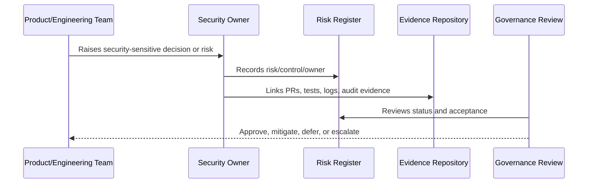

# Security Policy Framework

> *"Defines how CLARA security policies should be structured, approved, versioned, communicated, and reviewed."*

---

# Purpose

Defines how CLARA security policies should be structured, approved, versioned, communicated, and reviewed.

---

# Governance Problem

Long policies that nobody reads or maps to controls do not improve real security.

---

# Governance Decision

## Decision

CLARA policies should be short, actionable, versioned, owner-assigned, and mapped to implementation controls.

## Status

Accepted.

---

# Governance Rule

Every security governance area must be managed as:

```text
Principle -> Owner -> Control -> Evidence -> Review Cadence -> Risk Decision
```

A control is not mature unless there is:

```text
clear owner
clear implementation path
clear evidence
clear review rhythm
clear exception process
```

---

# Recommended Governance Flow



---

# Secure-by-Design Checklist

- [ ] Owner is defined.
- [ ] Backup owner is defined where needed.
- [ ] Risk is documented.
- [ ] Control is mapped to implementation.
- [ ] Evidence source is defined.
- [ ] Review cadence is defined.
- [ ] Exception path is defined.
- [ ] Escalation path is defined.
- [ ] Impact on AI/integrations/data is considered where relevant.

---

# Acceptance Criteria

- [ ] Governance responsibility is clear.
- [ ] Risk/control relationship is clear.
- [ ] Evidence expectations are clear.
- [ ] Review rhythm is clear.
- [ ] Security exceptions are handled explicitly.
- [ ] AI coding assistants can follow this safely.

---

# Anti-patterns

Avoid:

- Security ownership by assumption.
- Risk acceptance without named approver.
- Policies with no implementation controls.
- Controls with no evidence.
- Reviews with no follow-up owner.
- Audit readiness only after an audit request.
- Treating AI and integrations as normal low-risk features.
- Hiding known risks inside informal chat.

---

# Related Documents

- ../../BOOK-05-Engineering-Execution-Plan/PART-08-Security-Implementation-Plan/README.md
- ../../BOOK-05-Engineering-Execution-Plan/PART-10-DevOps-and-Release-Execution/README.md
- ../../BOOK-05-Engineering-Execution-Plan/PART-12-Production-Readiness-and-Handover/README.md
- ../../BOOK-04-Product-Domain-Specification/BOOK-04-Master-Index/BOOK-04-AI-GOVERNANCE-MAP.md
- ../../BOOK-04-Product-Domain-Specification/BOOK-04-Master-Index/BOOK-04-PERMISSION-MAP.md

---

# Navigation

**Previous:** `05-Risk-Management-Framework.md`

**Next:** `07-Security-Control-Taxonomy.md`

---

# Policy Structure

Each policy should include:

```text
purpose
scope
policy statement
roles and responsibilities
required controls
exceptions
evidence
review cadence
owner
version history
```

---

# Recommended Initial Policies

```text
Access Control Policy
Data Protection Policy
Secure Development Policy
Secrets Management Policy
Incident Response Policy
AI Usage and Governance Policy
Integration and Third-Party Policy
Logging and Audit Policy
```
