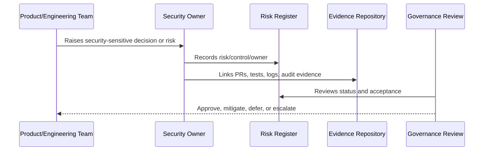

# Security Control Taxonomy

> *"Defines CLARA's control categories across identity, access, data, application, AI, integrations, infrastructure, logging, incident response, and compliance."*

---

# Purpose

Defines CLARA's control categories across identity, access, data, application, AI, integrations, infrastructure, logging, incident response, and compliance.

---

# Governance Problem

Without a control taxonomy, security work becomes duplicated, inconsistent, and hard to audit.

---

# Governance Decision

## Decision

CLARA should organize security controls into a clear taxonomy so implementation, testing, audit, and ownership can be mapped consistently.

## Status

Accepted.

---

# Governance Rule

Every security governance area must be managed as:

```text
Principle -> Owner -> Control -> Evidence -> Review Cadence -> Risk Decision
```

A control is not mature unless there is:

```text
clear owner
clear implementation path
clear evidence
clear review rhythm
clear exception process
```

---

# Recommended Governance Flow



---

# Secure-by-Design Checklist

- [ ] Owner is defined.
- [ ] Backup owner is defined where needed.
- [ ] Risk is documented.
- [ ] Control is mapped to implementation.
- [ ] Evidence source is defined.
- [ ] Review cadence is defined.
- [ ] Exception path is defined.
- [ ] Escalation path is defined.
- [ ] Impact on AI/integrations/data is considered where relevant.

---

# Acceptance Criteria

- [ ] Governance responsibility is clear.
- [ ] Risk/control relationship is clear.
- [ ] Evidence expectations are clear.
- [ ] Review rhythm is clear.
- [ ] Security exceptions are handled explicitly.
- [ ] AI coding assistants can follow this safely.

---

# Anti-patterns

Avoid:

- Security ownership by assumption.
- Risk acceptance without named approver.
- Policies with no implementation controls.
- Controls with no evidence.
- Reviews with no follow-up owner.
- Audit readiness only after an audit request.
- Treating AI and integrations as normal low-risk features.
- Hiding known risks inside informal chat.

---

# Related Documents

- ../../BOOK-05-Engineering-Execution-Plan/PART-08-Security-Implementation-Plan/README.md
- ../../BOOK-05-Engineering-Execution-Plan/PART-10-DevOps-and-Release-Execution/README.md
- ../../BOOK-05-Engineering-Execution-Plan/PART-12-Production-Readiness-and-Handover/README.md
- ../../BOOK-04-Product-Domain-Specification/BOOK-04-Master-Index/BOOK-04-AI-GOVERNANCE-MAP.md
- ../../BOOK-04-Product-Domain-Specification/BOOK-04-Master-Index/BOOK-04-PERMISSION-MAP.md

---

# Navigation

**Previous:** `06-Security-Policy-Framework.md`

**Next:** `08-Decision-Rights-and-Approval-Authority.md`

---

# Control Categories

CLARA controls should be grouped into:

```text
identity and access
tenant/workspace isolation
application security
data protection
AI security and governance
integration security
infrastructure security
logging and monitoring
audit and evidence
incident response
vendor/third-party risk
secure SDLC
```

---

# Control Record Template

```markdown
# Control

## Control ID
CLARA-CTRL-001

## Category
Identity and Access

## Requirement
What must be true.

## Implementation
Where/how implemented.

## Evidence
Where proof exists.

## Owner
Control owner.

## Review Cadence
Monthly/Quarterly/etc.
```
