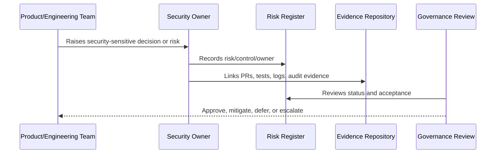

# Governance RACI Matrix

> *"Defines Responsible, Accountable, Consulted, and Informed roles for CLARA governance activities."*

---

# Purpose

Defines Responsible, Accountable, Consulted, and Informed roles for CLARA governance activities.

---

# Governance Problem

Ambiguous roles slow down response and weaken accountability.

---

# Governance Decision

## Decision

CLARA should use a practical RACI matrix for security-critical processes so ownership is visible and reviewable.

## Status

Accepted.

---

# Governance Rule

Every security governance area must be managed as:

```text
Principle -> Owner -> Control -> Evidence -> Review Cadence -> Risk Decision
```

A control is not mature unless there is:

```text
clear owner
clear implementation path
clear evidence
clear review rhythm
clear exception process
```

---

# Recommended Governance Flow



---

# Secure-by-Design Checklist

- [ ] Owner is defined.
- [ ] Backup owner is defined where needed.
- [ ] Risk is documented.
- [ ] Control is mapped to implementation.
- [ ] Evidence source is defined.
- [ ] Review cadence is defined.
- [ ] Exception path is defined.
- [ ] Escalation path is defined.
- [ ] Impact on AI/integrations/data is considered where relevant.

---

# Acceptance Criteria

- [ ] Governance responsibility is clear.
- [ ] Risk/control relationship is clear.
- [ ] Evidence expectations are clear.
- [ ] Review rhythm is clear.
- [ ] Security exceptions are handled explicitly.
- [ ] AI coding assistants can follow this safely.

---

# Anti-patterns

Avoid:

- Security ownership by assumption.
- Risk acceptance without named approver.
- Policies with no implementation controls.
- Controls with no evidence.
- Reviews with no follow-up owner.
- Audit readiness only after an audit request.
- Treating AI and integrations as normal low-risk features.
- Hiding known risks inside informal chat.

---

# Related Documents

- ../../BOOK-05-Engineering-Execution-Plan/PART-08-Security-Implementation-Plan/README.md
- ../../BOOK-05-Engineering-Execution-Plan/PART-10-DevOps-and-Release-Execution/README.md
- ../../BOOK-05-Engineering-Execution-Plan/PART-12-Production-Readiness-and-Handover/README.md
- ../../BOOK-04-Product-Domain-Specification/BOOK-04-Master-Index/BOOK-04-AI-GOVERNANCE-MAP.md
- ../../BOOK-04-Product-Domain-Specification/BOOK-04-Master-Index/BOOK-04-PERMISSION-MAP.md

---

# Navigation

**Previous:** `10-Evidence-and-Auditability-Model.md`

**Next:** `12-Part-01-Summary.md`

---

# Governance RACI

| Activity | Responsible | Accountable | Consulted | Informed |
|---|---|---|---|---|
| Access review | Security/Platform | Engineering Lead | Product | Team |
| Risk register | Security Owner | Engineering Lead | Product/Ops | Team |
| AI governance review | AI Owner | Product + Security | Engineering | Support |
| Integration review | Integration Owner | Engineering Lead | Security | Support |
| Incident response | Incident Commander | Engineering Lead | Security/Product | Stakeholders |
| Production readiness | Platform/Ops | Engineering Lead | QA/Security/Product | Team |
| Policy update | Security Owner | Engineering Lead | Product/Ops | Team |

---

# RACI Rule

For high-risk areas, never leave Accountable blank.
