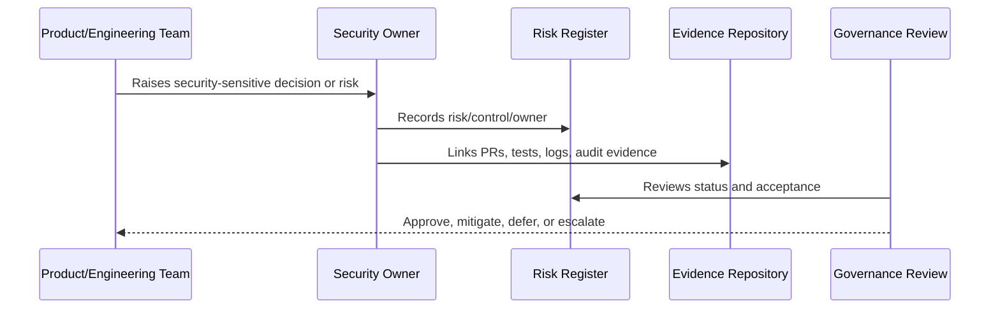

# Part 01 Summary

> *"Summarizes Security Governance Foundation and prepares for Book VI Part 02."*

---

# Purpose

Summarizes Security Governance Foundation and prepares for Book VI Part 02.

---

# Governance Problem

Policies and standards need governance foundation first, otherwise they become disconnected documents.

---

# Governance Decision

## Decision

CLARA should proceed to security policy and standards only after governance principles, ownership, operating model, risk framework, controls, approvals, cadence, evidence, and RACI are defined.

## Status

Accepted.

---

# Governance Rule

Every security governance area must be managed as:

```text
Principle -> Owner -> Control -> Evidence -> Review Cadence -> Risk Decision
```

A control is not mature unless there is:

```text
clear owner
clear implementation path
clear evidence
clear review rhythm
clear exception process
```

---

# Recommended Governance Flow



---

# Secure-by-Design Checklist

- [ ] Owner is defined.
- [ ] Backup owner is defined where needed.
- [ ] Risk is documented.
- [ ] Control is mapped to implementation.
- [ ] Evidence source is defined.
- [ ] Review cadence is defined.
- [ ] Exception path is defined.
- [ ] Escalation path is defined.
- [ ] Impact on AI/integrations/data is considered where relevant.

---

# Acceptance Criteria

- [ ] Governance responsibility is clear.
- [ ] Risk/control relationship is clear.
- [ ] Evidence expectations are clear.
- [ ] Review rhythm is clear.
- [ ] Security exceptions are handled explicitly.
- [ ] AI coding assistants can follow this safely.

---

# Anti-patterns

Avoid:

- Security ownership by assumption.
- Risk acceptance without named approver.
- Policies with no implementation controls.
- Controls with no evidence.
- Reviews with no follow-up owner.
- Audit readiness only after an audit request.
- Treating AI and integrations as normal low-risk features.
- Hiding known risks inside informal chat.

---

# Related Documents

- ../../BOOK-05-Engineering-Execution-Plan/PART-08-Security-Implementation-Plan/README.md
- ../../BOOK-05-Engineering-Execution-Plan/PART-10-DevOps-and-Release-Execution/README.md
- ../../BOOK-05-Engineering-Execution-Plan/PART-12-Production-Readiness-and-Handover/README.md
- ../../BOOK-04-Product-Domain-Specification/BOOK-04-Master-Index/BOOK-04-AI-GOVERNANCE-MAP.md
- ../../BOOK-04-Product-Domain-Specification/BOOK-04-Master-Index/BOOK-04-PERMISSION-MAP.md

---

# Navigation

**Previous:** `11-Governance-RACI-Matrix.md`

**Next:** `../PART-02-Security-Policies-and-Standards/README.md`

---

# Part 01 Completion

Part 01 establishes:

- Book VI scope.
- Security governance principles.
- Ownership and accountability.
- Security operating model.
- Risk management framework.
- Security policy framework.
- Security control taxonomy.
- Decision rights and approval authority.
- Security cadence and review rhythm.
- Evidence and auditability model.
- Governance RACI matrix.

---

# Ready for Part 02

The next part should be:

```text
BOOK VI — PART 02: Security Policies and Standards
```

It should define:

- Access Control Policy.
- Data Protection Policy.
- Secure Development Policy.
- Secrets Management Policy.
- Logging and Audit Policy.
- AI Usage Policy.
- Integration Security Policy.
- Incident Response Policy.
- Vulnerability Management Policy.
- Policy exception process.
