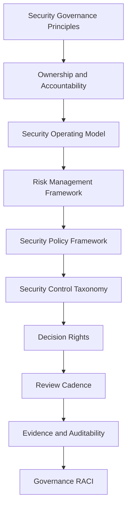

# PART-01 — Security Governance Foundation

> *"Security is not only what CLARA prevents. Security is how CLARA makes responsible decisions."*

---

# Purpose

Part 01 defines the governance foundation for CLARA security, risk, and compliance.

It covers:

- Book VI overview.
- Security governance principles.
- Security ownership and accountability.
- Security operating model.
- Risk management framework.
- Security policy framework.
- Security control taxonomy.
- Decision rights and approval authority.
- Security cadence and review rhythm.
- Evidence and auditability model.
- Governance RACI matrix.

---

# Chapter Map

| Chapter | Title |
|---:|---|
| 01 | Book VI Overview |
| 02 | Security Governance Principles |
| 03 | Security Ownership and Accountability |
| 04 | Security Operating Model |
| 05 | Risk Management Framework |
| 06 | Security Policy Framework |
| 07 | Security Control Taxonomy |
| 08 | Decision Rights and Approval Authority |
| 09 | Security Cadence and Review Rhythm |
| 10 | Evidence and Auditability Model |
| 11 | Governance RACI Matrix |
| 12 | Part 01 Summary |

---

# Book VI Scope

Book VI focuses on:

```text
security governance
risk management
policy and standards
access governance
data governance
AI governance
integration governance
audit readiness
compliance readiness
incident governance
vendor/third-party risk
privacy governance
evidence management
```

Book VI does not replace Book V.

Book V defines how to implement.

Book VI defines how to govern, review, prove, and improve.

---

# Governance Foundation Map



---

# Governance Non-Negotiables

CLARA governance must enforce:

```text
clear security ownership
risk tracking
least privilege
documented approval authority
audit evidence
recurring access reviews
AI governance
integration governance
incident learning
known limitation tracking
security exception tracking
```

---

# Relationship to Previous Books

| Book | Relationship |
|---|---|
| Book I | Defines foundation and philosophy |
| Book II | Defines master blueprint |
| Book III | Defines implementation architecture |
| Book IV | Defines product/domain behavior |
| Book V | Defines engineering execution |
| Book VI | Defines security governance and compliance operating model |

---

# Navigation

**Previous:** `../BOOK-05-Engineering-Execution-Plan/BOOK-05-Master-Index/README.md`

**Next:** `01-Book-VI-Overview.md`
