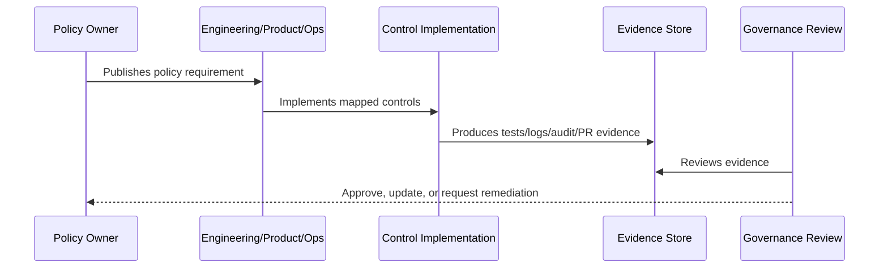

# Access Control Policy

> *"Defines policy for user access, roles, permissions, least privilege, access reviews, admin privileges, service access, and emergency access."*

---

# Purpose

Defines policy for user access, roles, permissions, least privilege, access reviews, admin privileges, service access, and emergency access.

---

# Policy Problem

Weak access policy can lead to unauthorized data access, privilege abuse, cross-tenant leakage, and unclear accountability.

---

# Policy Decision

## Decision

CLARA access must follow least privilege, role-based authorization, workspace/organization scoping, periodic review, and auditability.

## Status

Accepted.

---

# Policy Rule

Every CLARA policy must be defined as:

```text
Policy Statement -> Required Controls -> Evidence -> Owner -> Review Cadence -> Exception Process
```

A policy is incomplete if it does not explain how it is enforced or proven.

---

# Recommended Policy Flow



---

# Required Policy Fields

Every policy should include:

```text
purpose
scope
policy statement
required controls
roles and responsibilities
evidence
exceptions
review cadence
owner
version history
```

---

# Secure-by-Design Checklist

- [ ] Policy scope is clear.
- [ ] Required controls are clear.
- [ ] Evidence source is clear.
- [ ] Owner is defined.
- [ ] Review cadence is defined.
- [ ] Exception process is defined.
- [ ] AI/integration/data impact is considered where relevant.
- [ ] Security and compliance impact is considered.
- [ ] Implementation reference to Book V exists where relevant.

---

# Acceptance Criteria

- [ ] Policy can be understood by junior engineers.
- [ ] Policy can be enforced in code/process.
- [ ] Policy can be tested or reviewed.
- [ ] Policy can produce evidence.
- [ ] Exceptions are handled explicitly.
- [ ] AI coding assistants can follow this safely.

---

# Anti-patterns

Avoid:

- Policy statements with no owner.
- Policy statements with no evidence.
- Policy statements that cannot be tested.
- Exceptions with no expiration date.
- Policies copied from enterprise templates but not adapted to CLARA.
- Treating AI and integrations as ordinary low-risk features.
- Allowing undocumented production exceptions.

---

# Related Documents

- ../PART-01-Security-Governance-Foundation/README.md
- ../../BOOK-05-Engineering-Execution-Plan/PART-08-Security-Implementation-Plan/README.md
- ../../BOOK-05-Engineering-Execution-Plan/PART-09-Testing-and-QA-Execution/README.md
- ../../BOOK-05-Engineering-Execution-Plan/PART-12-Production-Readiness-and-Handover/README.md

---

# Navigation

**Previous:** `13-Security-Policies-and-Standards-Overview.md`

**Next:** `15-Data-Protection-and-Privacy-Policy.md`

---

# Policy Statement

CLARA access must be granted using least privilege, role-based authorization, organization/workspace scope, and server-side enforcement.

---

# Required Controls

- Backend authorization for every protected action.
- Organization/workspace scope on scoped resources.
- Role and permission mapping.
- Access review cadence.
- Admin access audit.
- Emergency access process.
- Service account ownership where applicable.

---

# Evidence

Evidence may include:

```text
RBAC tests
cross-workspace tests
access review records
audit logs for role changes
membership change logs
admin access list
```

---

# Exceptions

Any exception that grants elevated access must be:

```text
time-bound
owner-approved
audited
reviewed
revoked when no longer needed
```
