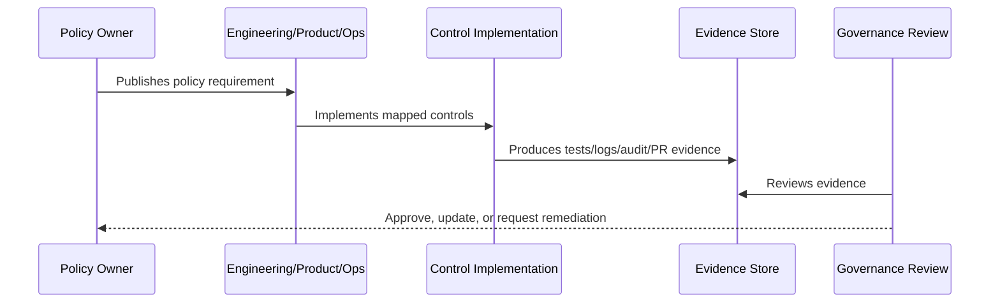

# Data Protection and Privacy Policy

> *"Defines policy for protecting customer data, conversation data, internal notes, AI context, exports, retention, deletion, and privacy boundaries."*

---

# Purpose

Defines policy for protecting customer data, conversation data, internal notes, AI context, exports, retention, deletion, and privacy boundaries.

---

# Policy Problem

Customer and business data can create trust, legal, and operational risk if collected, processed, or exposed carelessly.

---

# Policy Decision

## Decision

CLARA should protect data through minimization, scoped access, safe storage, safe processing, retention discipline, and privacy-aware defaults.

## Status

Accepted.

---

# Policy Rule

Every CLARA policy must be defined as:

```text
Policy Statement -> Required Controls -> Evidence -> Owner -> Review Cadence -> Exception Process
```

A policy is incomplete if it does not explain how it is enforced or proven.

---

# Recommended Policy Flow



---

# Required Policy Fields

Every policy should include:

```text
purpose
scope
policy statement
required controls
roles and responsibilities
evidence
exceptions
review cadence
owner
version history
```

---

# Secure-by-Design Checklist

- [ ] Policy scope is clear.
- [ ] Required controls are clear.
- [ ] Evidence source is clear.
- [ ] Owner is defined.
- [ ] Review cadence is defined.
- [ ] Exception process is defined.
- [ ] AI/integration/data impact is considered where relevant.
- [ ] Security and compliance impact is considered.
- [ ] Implementation reference to Book V exists where relevant.

---

# Acceptance Criteria

- [ ] Policy can be understood by junior engineers.
- [ ] Policy can be enforced in code/process.
- [ ] Policy can be tested or reviewed.
- [ ] Policy can produce evidence.
- [ ] Exceptions are handled explicitly.
- [ ] AI coding assistants can follow this safely.

---

# Anti-patterns

Avoid:

- Policy statements with no owner.
- Policy statements with no evidence.
- Policy statements that cannot be tested.
- Exceptions with no expiration date.
- Policies copied from enterprise templates but not adapted to CLARA.
- Treating AI and integrations as ordinary low-risk features.
- Allowing undocumented production exceptions.

---

# Related Documents

- ../PART-01-Security-Governance-Foundation/README.md
- ../../BOOK-05-Engineering-Execution-Plan/PART-08-Security-Implementation-Plan/README.md
- ../../BOOK-05-Engineering-Execution-Plan/PART-09-Testing-and-QA-Execution/README.md
- ../../BOOK-05-Engineering-Execution-Plan/PART-12-Production-Readiness-and-Handover/README.md

---

# Navigation

**Previous:** `14-Access-Control-Policy.md`

**Next:** `16-Secure-Development-Policy.md`

---

# Policy Statement

CLARA must protect customer and business data through minimization, scoped access, retention discipline, safe processing, and privacy-aware defaults.

---

# Protected Data

Protected data includes:

```text
customer profiles
contact points
conversation messages
internal notes
tickets
knowledge articles
AI context and outputs
integration payload metadata
audit logs
exports
attachments
```

---

# Required Controls

- Tenant/workspace access enforcement.
- Data minimization in APIs and AI context.
- Safe retention/deletion policy.
- Export permission checks and audit.
- Safe attachment handling.
- No real customer data in development/test seeds.
- Secure logging redaction.

---

# Evidence

```text
data model review
scope tests
export audit events
retention policy notes
test data review
log redaction tests
```
