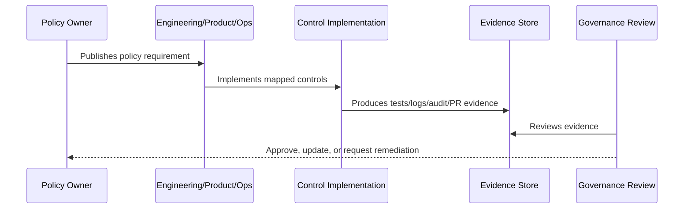

# Secure Development Policy

> *"Defines policy for secure software development lifecycle, code review, testing, dependency management, threat modeling, and release gates."*

---

# Purpose

Defines policy for secure software development lifecycle, code review, testing, dependency management, threat modeling, and release gates.

---

# Policy Problem

Security issues become more expensive and dangerous when found only after release.

---

# Policy Decision

## Decision

CLARA development must follow secure-by-design practices, with security considered before merge and before release.

## Status

Accepted.

---

# Policy Rule

Every CLARA policy must be defined as:

```text
Policy Statement -> Required Controls -> Evidence -> Owner -> Review Cadence -> Exception Process
```

A policy is incomplete if it does not explain how it is enforced or proven.

---

# Recommended Policy Flow



---

# Required Policy Fields

Every policy should include:

```text
purpose
scope
policy statement
required controls
roles and responsibilities
evidence
exceptions
review cadence
owner
version history
```

---

# Secure-by-Design Checklist

- [ ] Policy scope is clear.
- [ ] Required controls are clear.
- [ ] Evidence source is clear.
- [ ] Owner is defined.
- [ ] Review cadence is defined.
- [ ] Exception process is defined.
- [ ] AI/integration/data impact is considered where relevant.
- [ ] Security and compliance impact is considered.
- [ ] Implementation reference to Book V exists where relevant.

---

# Acceptance Criteria

- [ ] Policy can be understood by junior engineers.
- [ ] Policy can be enforced in code/process.
- [ ] Policy can be tested or reviewed.
- [ ] Policy can produce evidence.
- [ ] Exceptions are handled explicitly.
- [ ] AI coding assistants can follow this safely.

---

# Anti-patterns

Avoid:

- Policy statements with no owner.
- Policy statements with no evidence.
- Policy statements that cannot be tested.
- Exceptions with no expiration date.
- Policies copied from enterprise templates but not adapted to CLARA.
- Treating AI and integrations as ordinary low-risk features.
- Allowing undocumented production exceptions.

---

# Related Documents

- ../PART-01-Security-Governance-Foundation/README.md
- ../../BOOK-05-Engineering-Execution-Plan/PART-08-Security-Implementation-Plan/README.md
- ../../BOOK-05-Engineering-Execution-Plan/PART-09-Testing-and-QA-Execution/README.md
- ../../BOOK-05-Engineering-Execution-Plan/PART-12-Production-Readiness-and-Handover/README.md

---

# Navigation

**Previous:** `15-Data-Protection-and-Privacy-Policy.md`

**Next:** `17-Secrets-Management-Policy.md`

---

# Policy Statement

CLARA engineering must follow secure development practices from design through release.

---

# Required Controls

- Threat/risk review for high-risk features.
- Code review before merge.
- CI quality gates.
- Security tests for protected actions.
- Dependency review/scanning.
- Secret scanning where practical.
- Secure defaults for production.
- Documentation updates for behavior changes.

---

# Minimum PR Requirements

Every meaningful PR should include:

```text
scope summary
related docs
security impact
test evidence
migration impact if any
rollback/disable note for risky changes
```

---

# Evidence

```text
PR reviews
CI results
security test results
dependency scan reports
docs diff
release checklist
```
