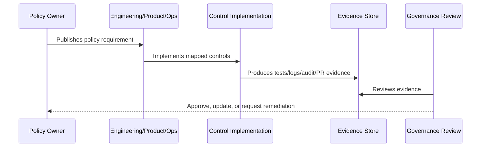

# Secrets Management Policy

> *"Defines policy for API keys, tokens, passwords, provider credentials, webhook secrets, encryption keys, rotation, storage, and exposure handling."*

---

# Purpose

Defines policy for API keys, tokens, passwords, provider credentials, webhook secrets, encryption keys, rotation, storage, and exposure handling.

---

# Policy Problem

Secret leakage can compromise CLARA infrastructure, AI providers, integrations, customer data, and production environments.

---

# Policy Decision

## Decision

CLARA must keep secrets out of source code, frontend bundles, logs, screenshots, documentation, test fixtures, and normal database rows.

## Status

Accepted.

---

# Policy Rule

Every CLARA policy must be defined as:

```text
Policy Statement -> Required Controls -> Evidence -> Owner -> Review Cadence -> Exception Process
```

A policy is incomplete if it does not explain how it is enforced or proven.

---

# Recommended Policy Flow



---

# Required Policy Fields

Every policy should include:

```text
purpose
scope
policy statement
required controls
roles and responsibilities
evidence
exceptions
review cadence
owner
version history
```

---

# Secure-by-Design Checklist

- [ ] Policy scope is clear.
- [ ] Required controls are clear.
- [ ] Evidence source is clear.
- [ ] Owner is defined.
- [ ] Review cadence is defined.
- [ ] Exception process is defined.
- [ ] AI/integration/data impact is considered where relevant.
- [ ] Security and compliance impact is considered.
- [ ] Implementation reference to Book V exists where relevant.

---

# Acceptance Criteria

- [ ] Policy can be understood by junior engineers.
- [ ] Policy can be enforced in code/process.
- [ ] Policy can be tested or reviewed.
- [ ] Policy can produce evidence.
- [ ] Exceptions are handled explicitly.
- [ ] AI coding assistants can follow this safely.

---

# Anti-patterns

Avoid:

- Policy statements with no owner.
- Policy statements with no evidence.
- Policy statements that cannot be tested.
- Exceptions with no expiration date.
- Policies copied from enterprise templates but not adapted to CLARA.
- Treating AI and integrations as ordinary low-risk features.
- Allowing undocumented production exceptions.

---

# Related Documents

- ../PART-01-Security-Governance-Foundation/README.md
- ../../BOOK-05-Engineering-Execution-Plan/PART-08-Security-Implementation-Plan/README.md
- ../../BOOK-05-Engineering-Execution-Plan/PART-09-Testing-and-QA-Execution/README.md
- ../../BOOK-05-Engineering-Execution-Plan/PART-12-Production-Readiness-and-Handover/README.md

---

# Navigation

**Previous:** `16-Secure-Development-Policy.md`

**Next:** `18-Logging-Audit-and-Evidence-Policy.md`

---

# Policy Statement

CLARA secrets must never be committed, logged, embedded into frontend bundles, or stored as raw visible values in normal database tables.

---

# Secrets Include

```text
database credentials
JWT/session secrets
AI provider keys
OAuth tokens
API keys
webhook signing secrets
encryption keys
SMTP/email credentials
third-party provider tokens
```

---

# Required Controls

- `.env.example` uses fake placeholders only.
- `.env.local` and real env files are ignored.
- Production secrets come from secure runtime/secret storage.
- Credential metadata uses secret references.
- Secrets are redacted from logs.
- Secret rotation process exists.
- Secret exposure incident process exists.

---

# Exposure Response

If a secret is exposed:

```text
revoke/rotate immediately
assess access logs if available
remove from repo/history where practical
create incident record
document affected systems
```
