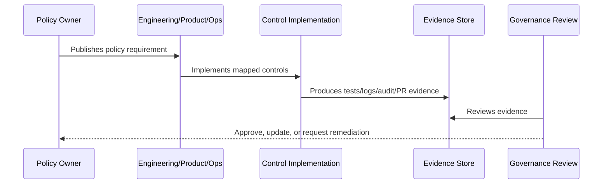

# Logging Audit and Evidence Policy

> *"Defines policy for operational logs, audit logs, security events, redaction, retention, evidence quality, and audit readiness."*

---

# Purpose

Defines policy for operational logs, audit logs, security events, redaction, retention, evidence quality, and audit readiness.

---

# Policy Problem

Logs without structure are hard to investigate; logs with too much sensitive data become privacy and security liabilities.

---

# Policy Decision

## Decision

CLARA logs and audit records must be useful for investigation while minimizing sensitive data exposure.

## Status

Accepted.

---

# Policy Rule

Every CLARA policy must be defined as:

```text
Policy Statement -> Required Controls -> Evidence -> Owner -> Review Cadence -> Exception Process
```

A policy is incomplete if it does not explain how it is enforced or proven.

---

# Recommended Policy Flow



---

# Required Policy Fields

Every policy should include:

```text
purpose
scope
policy statement
required controls
roles and responsibilities
evidence
exceptions
review cadence
owner
version history
```

---

# Secure-by-Design Checklist

- [ ] Policy scope is clear.
- [ ] Required controls are clear.
- [ ] Evidence source is clear.
- [ ] Owner is defined.
- [ ] Review cadence is defined.
- [ ] Exception process is defined.
- [ ] AI/integration/data impact is considered where relevant.
- [ ] Security and compliance impact is considered.
- [ ] Implementation reference to Book V exists where relevant.

---

# Acceptance Criteria

- [ ] Policy can be understood by junior engineers.
- [ ] Policy can be enforced in code/process.
- [ ] Policy can be tested or reviewed.
- [ ] Policy can produce evidence.
- [ ] Exceptions are handled explicitly.
- [ ] AI coding assistants can follow this safely.

---

# Anti-patterns

Avoid:

- Policy statements with no owner.
- Policy statements with no evidence.
- Policy statements that cannot be tested.
- Exceptions with no expiration date.
- Policies copied from enterprise templates but not adapted to CLARA.
- Treating AI and integrations as ordinary low-risk features.
- Allowing undocumented production exceptions.

---

# Related Documents

- ../PART-01-Security-Governance-Foundation/README.md
- ../../BOOK-05-Engineering-Execution-Plan/PART-08-Security-Implementation-Plan/README.md
- ../../BOOK-05-Engineering-Execution-Plan/PART-09-Testing-and-QA-Execution/README.md
- ../../BOOK-05-Engineering-Execution-Plan/PART-12-Production-Readiness-and-Handover/README.md

---

# Navigation

**Previous:** `17-Secrets-Management-Policy.md`

**Next:** `19-AI-Usage-and-Governance-Policy.md`

---

# Policy Statement

CLARA logging and audit evidence must support investigation and governance without exposing unnecessary sensitive data.

---

# Required Controls

- Structured operational logs.
- Safe request/correlation IDs.
- Redaction of secrets and sensitive payloads.
- Audit logs for sensitive actions.
- Security event records.
- Retention policy for logs/evidence.
- Evidence links for audits and readiness reviews.

---

# Audit Events Required For

```text
login/security events
role/membership changes
customer export/update/archive
conversation send/reply/assignment
ticket status/assignment
knowledge publish/archive/visibility
AI draft/review/safety block
integration credential/connect/disconnect
workflow activation/execution
admin/settings/billing changes
```

---

# Do Not Log

```text
passwords
tokens
API keys
full AI prompts by default
raw customer message bodies by default
raw webhook payloads with secrets
payment details
```
