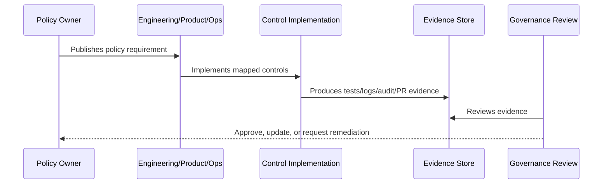

# AI Usage and Governance Policy

> *"Defines policy for AI feature usage, model providers, prompt governance, context boundaries, RAG, human review, AI audit, feedback, and safety."*

---

# Purpose

Defines policy for AI feature usage, model providers, prompt governance, context boundaries, RAG, human review, AI audit, feedback, and safety.

---

# Policy Problem

AI can leak context, hallucinate, follow malicious prompts, or mutate workflows if usage is not governed.

---

# Policy Decision

## Decision

CLARA AI must remain assistive, permission-aware, reviewable, auditable, and bounded by product and security controls.

## Status

Accepted.

---

# Policy Rule

Every CLARA policy must be defined as:

```text
Policy Statement -> Required Controls -> Evidence -> Owner -> Review Cadence -> Exception Process
```

A policy is incomplete if it does not explain how it is enforced or proven.

---

# Recommended Policy Flow



---

# Required Policy Fields

Every policy should include:

```text
purpose
scope
policy statement
required controls
roles and responsibilities
evidence
exceptions
review cadence
owner
version history
```

---

# Secure-by-Design Checklist

- [ ] Policy scope is clear.
- [ ] Required controls are clear.
- [ ] Evidence source is clear.
- [ ] Owner is defined.
- [ ] Review cadence is defined.
- [ ] Exception process is defined.
- [ ] AI/integration/data impact is considered where relevant.
- [ ] Security and compliance impact is considered.
- [ ] Implementation reference to Book V exists where relevant.

---

# Acceptance Criteria

- [ ] Policy can be understood by junior engineers.
- [ ] Policy can be enforced in code/process.
- [ ] Policy can be tested or reviewed.
- [ ] Policy can produce evidence.
- [ ] Exceptions are handled explicitly.
- [ ] AI coding assistants can follow this safely.

---

# Anti-patterns

Avoid:

- Policy statements with no owner.
- Policy statements with no evidence.
- Policy statements that cannot be tested.
- Exceptions with no expiration date.
- Policies copied from enterprise templates but not adapted to CLARA.
- Treating AI and integrations as ordinary low-risk features.
- Allowing undocumented production exceptions.

---

# Related Documents

- ../PART-01-Security-Governance-Foundation/README.md
- ../../BOOK-05-Engineering-Execution-Plan/PART-08-Security-Implementation-Plan/README.md
- ../../BOOK-05-Engineering-Execution-Plan/PART-09-Testing-and-QA-Execution/README.md
- ../../BOOK-05-Engineering-Execution-Plan/PART-12-Production-Readiness-and-Handover/README.md

---

# Navigation

**Previous:** `18-Logging-Audit-and-Evidence-Policy.md`

**Next:** `20-Integration-and-Third-Party-Security-Policy.md`

---

# Policy Statement

CLARA AI must be assistive, permission-aware, reviewable, auditable, and bounded by human governance.

---

# Required Controls

- All AI requests go through AI Gateway.
- AI feature permission is checked.
- Underlying resource permission is checked.
- Context is minimized and scoped.
- Prompt templates are versioned.
- Customer-visible output requires human review in MVP.
- AI output is labeled.
- AI safety events are recorded.
- AI usage is metered.
- AI fallback/manual workflow exists.

---

# AI Must Not

```text
bypass RBAC
access unauthorized workspace data
auto-send customer replies in MVP
use private/draft knowledge as trusted source by default
reveal hidden prompts
execute high-risk actions without approval
log secrets or unnecessary sensitive content
```

---

# Evidence

```text
AI context tests
prompt version records
AI review/audit records
AI feedback data
AI safety test results
usage metrics
```
