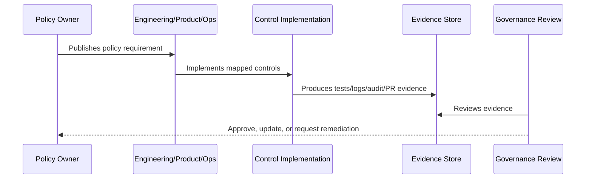

# Integration and Third Party Security Policy

> *"Defines policy for integrations, external providers, OAuth/API credentials, webhooks, third-party risk, vendor access, and connector lifecycle."*

---

# Purpose

Defines policy for integrations, external providers, OAuth/API credentials, webhooks, third-party risk, vendor access, and connector lifecycle.

---

# Policy Problem

External systems expand CLARA's attack surface and can introduce data leaks, credential exposure, and operational instability.

---

# Policy Decision

## Decision

CLARA integrations must be validated, scoped, idempotent, monitored, auditable, and governed by provider risk expectations.

## Status

Accepted.

---

# Policy Rule

Every CLARA policy must be defined as:

```text
Policy Statement -> Required Controls -> Evidence -> Owner -> Review Cadence -> Exception Process
```

A policy is incomplete if it does not explain how it is enforced or proven.

---

# Recommended Policy Flow



---

# Required Policy Fields

Every policy should include:

```text
purpose
scope
policy statement
required controls
roles and responsibilities
evidence
exceptions
review cadence
owner
version history
```

---

# Secure-by-Design Checklist

- [ ] Policy scope is clear.
- [ ] Required controls are clear.
- [ ] Evidence source is clear.
- [ ] Owner is defined.
- [ ] Review cadence is defined.
- [ ] Exception process is defined.
- [ ] AI/integration/data impact is considered where relevant.
- [ ] Security and compliance impact is considered.
- [ ] Implementation reference to Book V exists where relevant.

---

# Acceptance Criteria

- [ ] Policy can be understood by junior engineers.
- [ ] Policy can be enforced in code/process.
- [ ] Policy can be tested or reviewed.
- [ ] Policy can produce evidence.
- [ ] Exceptions are handled explicitly.
- [ ] AI coding assistants can follow this safely.

---

# Anti-patterns

Avoid:

- Policy statements with no owner.
- Policy statements with no evidence.
- Policy statements that cannot be tested.
- Exceptions with no expiration date.
- Policies copied from enterprise templates but not adapted to CLARA.
- Treating AI and integrations as ordinary low-risk features.
- Allowing undocumented production exceptions.

---

# Related Documents

- ../PART-01-Security-Governance-Foundation/README.md
- ../../BOOK-05-Engineering-Execution-Plan/PART-08-Security-Implementation-Plan/README.md
- ../../BOOK-05-Engineering-Execution-Plan/PART-09-Testing-and-QA-Execution/README.md
- ../../BOOK-05-Engineering-Execution-Plan/PART-12-Production-Readiness-and-Handover/README.md

---

# Navigation

**Previous:** `19-AI-Usage-and-Governance-Policy.md`

**Next:** `21-Incident-Response-Policy.md`

---

# Policy Statement

CLARA integrations and third-party connections must be validated, scoped, idempotent, monitored, and auditable.

---

# Required Controls

- Provider adapter pattern.
- Webhook signature/API key validation where applicable.
- Schema validation.
- Idempotency keys/external references.
- Credential metadata and secret references.
- Least privilege provider scopes.
- Retry/dead-letter handling.
- Integration health visibility.
- Connector lifecycle audit.

---

# Third-Party Review Considerations

Consider:

```text
data shared
credential type
provider access level
provider reliability
provider security posture
rate limits
policy/API terms
incident impact
```

---

# Evidence

```text
webhook tests
duplicate event tests
credential redaction proof
connector audit logs
integration health records
vendor/provider review notes
```
