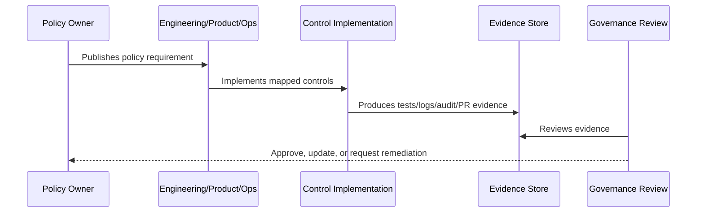

# Incident Response Policy

> *"Defines policy for detecting, declaring, triaging, responding to, communicating, recovering from, and learning from incidents."*

---

# Purpose

Defines policy for detecting, declaring, triaging, responding to, communicating, recovering from, and learning from incidents.

---

# Policy Problem

Improvised incident response wastes time and can increase customer, data, and reputational impact.

---

# Policy Decision

## Decision

CLARA must respond to security and reliability incidents through clear severity, ownership, containment, communication, recovery, and postmortem rules.

## Status

Accepted.

---

# Policy Rule

Every CLARA policy must be defined as:

```text
Policy Statement -> Required Controls -> Evidence -> Owner -> Review Cadence -> Exception Process
```

A policy is incomplete if it does not explain how it is enforced or proven.

---

# Recommended Policy Flow



---

# Required Policy Fields

Every policy should include:

```text
purpose
scope
policy statement
required controls
roles and responsibilities
evidence
exceptions
review cadence
owner
version history
```

---

# Secure-by-Design Checklist

- [ ] Policy scope is clear.
- [ ] Required controls are clear.
- [ ] Evidence source is clear.
- [ ] Owner is defined.
- [ ] Review cadence is defined.
- [ ] Exception process is defined.
- [ ] AI/integration/data impact is considered where relevant.
- [ ] Security and compliance impact is considered.
- [ ] Implementation reference to Book V exists where relevant.

---

# Acceptance Criteria

- [ ] Policy can be understood by junior engineers.
- [ ] Policy can be enforced in code/process.
- [ ] Policy can be tested or reviewed.
- [ ] Policy can produce evidence.
- [ ] Exceptions are handled explicitly.
- [ ] AI coding assistants can follow this safely.

---

# Anti-patterns

Avoid:

- Policy statements with no owner.
- Policy statements with no evidence.
- Policy statements that cannot be tested.
- Exceptions with no expiration date.
- Policies copied from enterprise templates but not adapted to CLARA.
- Treating AI and integrations as ordinary low-risk features.
- Allowing undocumented production exceptions.

---

# Related Documents

- ../PART-01-Security-Governance-Foundation/README.md
- ../../BOOK-05-Engineering-Execution-Plan/PART-08-Security-Implementation-Plan/README.md
- ../../BOOK-05-Engineering-Execution-Plan/PART-09-Testing-and-QA-Execution/README.md
- ../../BOOK-05-Engineering-Execution-Plan/PART-12-Production-Readiness-and-Handover/README.md

---

# Navigation

**Previous:** `20-Integration-and-Third-Party-Security-Policy.md`

**Next:** `22-Vulnerability-and-Patch-Management-Policy.md`

---

# Policy Statement

CLARA incidents must be detected, declared, triaged, contained, communicated, resolved, and reviewed through a clear process.

---

# Incident Severity

```text
SEV0: data leak, data loss, auth bypass, major outage
SEV1: critical feature unavailable or high-risk security issue
SEV2: significant degradation
SEV3: minor contained issue
```

---

# Required Controls

- Incident owner/commander.
- Severity classification.
- Containment steps.
- Communication channel.
- Recovery validation.
- Postmortem for significant incidents.
- Follow-up task tracking.

---

# Security Incident Examples

```text
credential leak
cross-tenant access
unauthorized admin access
AI context leak
webhook signature bypass
production data loss
```
