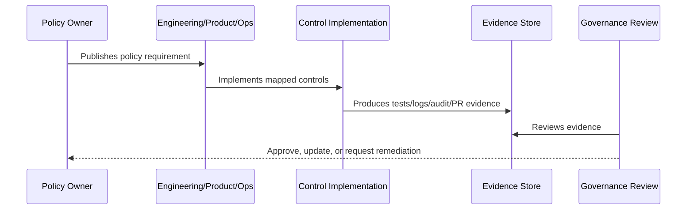

# Vulnerability and Patch Management Policy

> *"Defines policy for vulnerability intake, triage, severity, remediation timelines, dependency updates, patching, and verification."*

---

# Purpose

Defines policy for vulnerability intake, triage, severity, remediation timelines, dependency updates, patching, and verification.

---

# Policy Problem

Unmanaged vulnerabilities accumulate silently and can become known attack paths.

---

# Policy Decision

## Decision

CLARA vulnerabilities should be tracked, prioritized by risk, remediated within defined timelines, and verified before closure.

## Status

Accepted.

---

# Policy Rule

Every CLARA policy must be defined as:

```text
Policy Statement -> Required Controls -> Evidence -> Owner -> Review Cadence -> Exception Process
```

A policy is incomplete if it does not explain how it is enforced or proven.

---

# Recommended Policy Flow



---

# Required Policy Fields

Every policy should include:

```text
purpose
scope
policy statement
required controls
roles and responsibilities
evidence
exceptions
review cadence
owner
version history
```

---

# Secure-by-Design Checklist

- [ ] Policy scope is clear.
- [ ] Required controls are clear.
- [ ] Evidence source is clear.
- [ ] Owner is defined.
- [ ] Review cadence is defined.
- [ ] Exception process is defined.
- [ ] AI/integration/data impact is considered where relevant.
- [ ] Security and compliance impact is considered.
- [ ] Implementation reference to Book V exists where relevant.

---

# Acceptance Criteria

- [ ] Policy can be understood by junior engineers.
- [ ] Policy can be enforced in code/process.
- [ ] Policy can be tested or reviewed.
- [ ] Policy can produce evidence.
- [ ] Exceptions are handled explicitly.
- [ ] AI coding assistants can follow this safely.

---

# Anti-patterns

Avoid:

- Policy statements with no owner.
- Policy statements with no evidence.
- Policy statements that cannot be tested.
- Exceptions with no expiration date.
- Policies copied from enterprise templates but not adapted to CLARA.
- Treating AI and integrations as ordinary low-risk features.
- Allowing undocumented production exceptions.

---

# Related Documents

- ../PART-01-Security-Governance-Foundation/README.md
- ../../BOOK-05-Engineering-Execution-Plan/PART-08-Security-Implementation-Plan/README.md
- ../../BOOK-05-Engineering-Execution-Plan/PART-09-Testing-and-QA-Execution/README.md
- ../../BOOK-05-Engineering-Execution-Plan/PART-12-Production-Readiness-and-Handover/README.md

---

# Navigation

**Previous:** `21-Incident-Response-Policy.md`

**Next:** `23-Policy-Exception-and-Risk-Acceptance-Process.md`

---

# Policy Statement

CLARA vulnerabilities must be tracked, risk-ranked, remediated, verified, and reviewed.

---

# Vulnerability Sources

```text
dependency scans
secret scans
code review
security tests
external reports
incident findings
penetration testing
AI red-team tests
integration abuse tests
```

---

# Severity Guidance

| Severity | Examples | Expected Action |
|---|---|---|
| Critical | auth bypass, active data leak | Immediate response |
| High | privilege escalation, secret exposure | Prioritized remediation |
| Medium | exploitable weakness with limits | Scheduled fix |
| Low | hardening issue | Backlog with owner |

---

# Closure Rule

A vulnerability is closed only when remediation is verified and evidence is linked.
