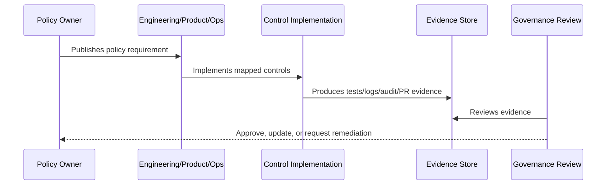

# Policy Exception and Risk Acceptance Process

> *"Defines how CLARA handles temporary exceptions, compensating controls, accepted risks, expiration dates, approvals, and re-review."*

---

# Purpose

Defines how CLARA handles temporary exceptions, compensating controls, accepted risks, expiration dates, approvals, and re-review.

---

# Policy Problem

Informal exceptions become permanent security gaps.

---

# Policy Decision

## Decision

CLARA policy exceptions must be explicit, time-bound, owner-approved, evidence-backed, and reviewed.

## Status

Accepted.

---

# Policy Rule

Every CLARA policy must be defined as:

```text
Policy Statement -> Required Controls -> Evidence -> Owner -> Review Cadence -> Exception Process
```

A policy is incomplete if it does not explain how it is enforced or proven.

---

# Recommended Policy Flow



---

# Required Policy Fields

Every policy should include:

```text
purpose
scope
policy statement
required controls
roles and responsibilities
evidence
exceptions
review cadence
owner
version history
```

---

# Secure-by-Design Checklist

- [ ] Policy scope is clear.
- [ ] Required controls are clear.
- [ ] Evidence source is clear.
- [ ] Owner is defined.
- [ ] Review cadence is defined.
- [ ] Exception process is defined.
- [ ] AI/integration/data impact is considered where relevant.
- [ ] Security and compliance impact is considered.
- [ ] Implementation reference to Book V exists where relevant.

---

# Acceptance Criteria

- [ ] Policy can be understood by junior engineers.
- [ ] Policy can be enforced in code/process.
- [ ] Policy can be tested or reviewed.
- [ ] Policy can produce evidence.
- [ ] Exceptions are handled explicitly.
- [ ] AI coding assistants can follow this safely.

---

# Anti-patterns

Avoid:

- Policy statements with no owner.
- Policy statements with no evidence.
- Policy statements that cannot be tested.
- Exceptions with no expiration date.
- Policies copied from enterprise templates but not adapted to CLARA.
- Treating AI and integrations as ordinary low-risk features.
- Allowing undocumented production exceptions.

---

# Related Documents

- ../PART-01-Security-Governance-Foundation/README.md
- ../../BOOK-05-Engineering-Execution-Plan/PART-08-Security-Implementation-Plan/README.md
- ../../BOOK-05-Engineering-Execution-Plan/PART-09-Testing-and-QA-Execution/README.md
- ../../BOOK-05-Engineering-Execution-Plan/PART-12-Production-Readiness-and-Handover/README.md

---

# Navigation

**Previous:** `22-Vulnerability-and-Patch-Management-Policy.md`

**Next:** `24-Part-02-Summary.md`

---

# Policy Statement

Policy exceptions and accepted risks must be explicit, temporary where possible, owner-approved, evidence-backed, and reviewed.

---

# Exception Record Template

```markdown
# Policy Exception

## Policy
Which policy is affected.

## Exception
What is being allowed.

## Reason
Why exception is needed.

## Risk
What could go wrong.

## Compensating Controls
What reduces risk.

## Owner
Who owns it.

## Approved By
Who approved it.

## Expiration / Review Date
When to review.

## Status
Open / Approved / Expired / Closed
```

---

# Risk Acceptance Rule

Critical/high risk acceptance requires leadership or designated accountable owner approval.

No silent acceptance.
