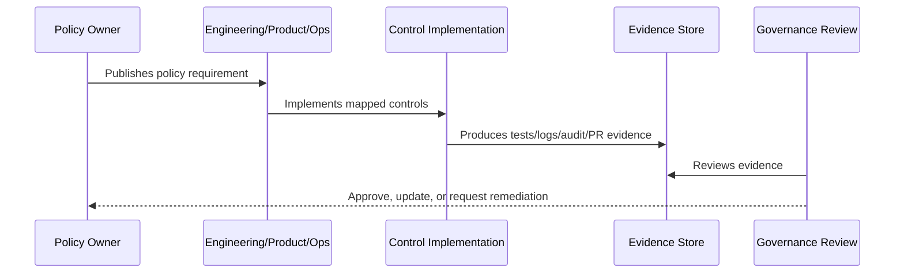

# Part 02 Summary

> *"Summarizes Security Policies and Standards and prepares for Book VI Part 03."*

---

# Purpose

Summarizes Security Policies and Standards and prepares for Book VI Part 03.

---

# Policy Problem

Identity and access governance depends on clear access, data, development, secret, audit, AI, integration, incident, vulnerability, and exception policies.

---

# Policy Decision

## Decision

CLARA should proceed to identity and access governance after defining enforceable security policies and standards.

## Status

Accepted.

---

# Policy Rule

Every CLARA policy must be defined as:

```text
Policy Statement -> Required Controls -> Evidence -> Owner -> Review Cadence -> Exception Process
```

A policy is incomplete if it does not explain how it is enforced or proven.

---

# Recommended Policy Flow



---

# Required Policy Fields

Every policy should include:

```text
purpose
scope
policy statement
required controls
roles and responsibilities
evidence
exceptions
review cadence
owner
version history
```

---

# Secure-by-Design Checklist

- [ ] Policy scope is clear.
- [ ] Required controls are clear.
- [ ] Evidence source is clear.
- [ ] Owner is defined.
- [ ] Review cadence is defined.
- [ ] Exception process is defined.
- [ ] AI/integration/data impact is considered where relevant.
- [ ] Security and compliance impact is considered.
- [ ] Implementation reference to Book V exists where relevant.

---

# Acceptance Criteria

- [ ] Policy can be understood by junior engineers.
- [ ] Policy can be enforced in code/process.
- [ ] Policy can be tested or reviewed.
- [ ] Policy can produce evidence.
- [ ] Exceptions are handled explicitly.
- [ ] AI coding assistants can follow this safely.

---

# Anti-patterns

Avoid:

- Policy statements with no owner.
- Policy statements with no evidence.
- Policy statements that cannot be tested.
- Exceptions with no expiration date.
- Policies copied from enterprise templates but not adapted to CLARA.
- Treating AI and integrations as ordinary low-risk features.
- Allowing undocumented production exceptions.

---

# Related Documents

- ../PART-01-Security-Governance-Foundation/README.md
- ../../BOOK-05-Engineering-Execution-Plan/PART-08-Security-Implementation-Plan/README.md
- ../../BOOK-05-Engineering-Execution-Plan/PART-09-Testing-and-QA-Execution/README.md
- ../../BOOK-05-Engineering-Execution-Plan/PART-12-Production-Readiness-and-Handover/README.md

---

# Navigation

**Previous:** `23-Policy-Exception-and-Risk-Acceptance-Process.md`

**Next:** `../PART-03-Identity-and-Access-Governance/README.md`

---

# Part 02 Completion

Part 02 establishes:

- Security policy framework.
- Access Control Policy.
- Data Protection and Privacy Policy.
- Secure Development Policy.
- Secrets Management Policy.
- Logging, Audit, and Evidence Policy.
- AI Usage and Governance Policy.
- Integration and Third Party Security Policy.
- Incident Response Policy.
- Vulnerability and Patch Management Policy.
- Policy Exception and Risk Acceptance Process.

---

# Ready for Part 03

The next part should be:

```text
BOOK VI — PART 03: Identity and Access Governance
```

It should define:

- Access governance model.
- Role governance.
- Permission lifecycle.
- Membership lifecycle.
- Admin access governance.
- Service account governance.
- Access review process.
- Privileged access management.
- Emergency access.
- Access audit evidence.
