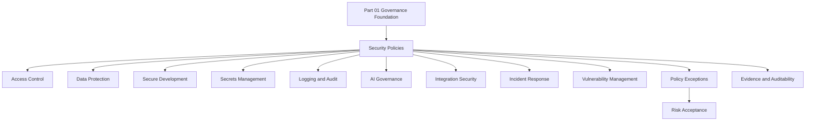

# PART-02 — Security Policies and Standards

> *"A policy is only useful when engineers can translate it into controls, tests, evidence, and decisions."*

---

# Purpose

Part 02 defines CLARA's security policy and standards layer.

It covers:

- Security policies and standards overview.
- Access Control Policy.
- Data Protection and Privacy Policy.
- Secure Development Policy.
- Secrets Management Policy.
- Logging, Audit, and Evidence Policy.
- AI Usage and Governance Policy.
- Integration and Third Party Security Policy.
- Incident Response Policy.
- Vulnerability and Patch Management Policy.
- Policy Exception and Risk Acceptance Process.

---

# Chapter Map

| Chapter | Title |
|---:|---|
| 13 | Security Policies and Standards Overview |
| 14 | Access Control Policy |
| 15 | Data Protection and Privacy Policy |
| 16 | Secure Development Policy |
| 17 | Secrets Management Policy |
| 18 | Logging Audit and Evidence Policy |
| 19 | AI Usage and Governance Policy |
| 20 | Integration and Third Party Security Policy |
| 21 | Incident Response Policy |
| 22 | Vulnerability and Patch Management Policy |
| 23 | Policy Exception and Risk Acceptance Process |
| 24 | Part 02 Summary |

---

# Policy Framework Map



---

# Policy Design Principles

CLARA policies must be:

```text
short enough to be read
specific enough to enforce
mapped to owners
mapped to controls
mapped to tests
mapped to evidence
reviewed on cadence
exception-aware
risk-aware
```

---

# Policy Non-Negotiables

CLARA policies must enforce:

```text
least privilege
server-side authorization
tenant/workspace isolation
data minimization
safe logging
secrets protection
secure development gates
AI human review for customer-visible output
integration validation and idempotency
incident response ownership
vulnerability tracking
documented risk acceptance
```

---

# Relationship to Book V

Book V defines how controls are implemented.

Book VI Part 02 defines the policies that require and govern those controls.

Example:

```text
Book VI Policy:
No protected action may rely on frontend-only authorization.

Book V Implementation:
Backend RBAC helper, route guards, authorization tests, CI gate.
```

---

# Navigation

**Previous:** `../PART-01-Security-Governance-Foundation/12-Part-01-Summary.md`

**Next:** `13-Security-Policies-and-Standards-Overview.md`
