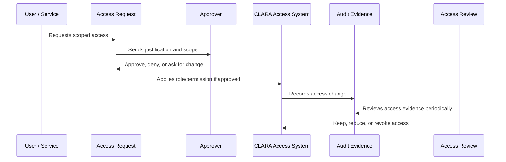

# Identity Governance Model

> *"Defines governance rules for human identities, user accounts, external identities, authentication ownership, identity lifecycle, and account states."*

---

# Purpose

Defines governance rules for human identities, user accounts, external identities, authentication ownership, identity lifecycle, and account states.

---

# Governance Problem

Unmanaged identities create orphaned access, unclear accountability, and weak incident investigation.

---

# Governance Decision

## Decision

CLARA identities should have clear lifecycle states, ownership, authentication assurance expectations, and auditability from creation through deactivation.

## Status

Accepted.

---

# Access Governance Rule

Every access decision in CLARA must be governed as:

```text
Identity -> Scope -> Role -> Permission -> Approval -> Evidence -> Review
```

No protected capability should exist without:

```text
owner
risk level
scope
approval path
audit evidence
review cadence
revocation path
```

---

# Recommended Governance Flow



---

# Secure-by-Design Checklist

- [ ] Identity owner is clear.
- [ ] Scope is clear.
- [ ] Role is appropriate.
- [ ] Permission risk level is understood.
- [ ] Approval path is defined.
- [ ] Access is time-bound where needed.
- [ ] Audit evidence is generated.
- [ ] Review cadence is defined.
- [ ] Revocation/offboarding path exists.
- [ ] Emergency process is defined where relevant.

---

# Acceptance Criteria

- [ ] Governance process is clear.
- [ ] Owners and approvers are clear.
- [ ] Evidence requirements are clear.
- [ ] Review cadence is clear.
- [ ] Exception process is explicit.
- [ ] Implementation references are aligned with Book V.
- [ ] AI coding assistants can follow this safely.

---

# Anti-patterns

Avoid:

- Shared user accounts.
- Permanent admin access without review.
- Roles with unclear purpose.
- Permissions created without owner or tests.
- Access granted through informal chat only.
- Service accounts with no owner.
- API keys without rotation/revocation plan.
- Break-glass access with no audit.
- Access reviews that do not remove anything.

---

# Related Documents

- ../PART-01-Security-Governance-Foundation/README.md
- ../PART-02-Security-Policies-and-Standards/14-Access-Control-Policy.md
- ../../BOOK-05-Engineering-Execution-Plan/PART-03-Backend-Implementation-Plan/31-Authorization-RBAC-Implementation-Plan.md
- ../../BOOK-05-Engineering-Execution-Plan/PART-08-Security-Implementation-Plan/129-Authorization-and-RBAC-Enforcement.md
- ../../BOOK-04-Product-Domain-Specification/BOOK-04-Master-Index/BOOK-04-PERMISSION-MAP.md

---

# Navigation

**Previous:** `25-Identity-and-Access-Governance-Overview.md`

**Next:** `27-Role-Governance-Model.md`

---

# Identity Types

CLARA may have:

```text
human user
internal operator
external collaborator
service account
integration identity
CI/CD identity
system worker identity
```

---

# Identity Lifecycle States

Recommended states:

```text
invited
active
suspended
deactivated
deleted/removed
```

---

# Identity Governance Rules

- Every identity must be uniquely attributable.
- Shared human accounts are not allowed.
- Deactivated identities must lose active access.
- Identity lifecycle events must be audited.
- External identities must be scoped and reviewed.
