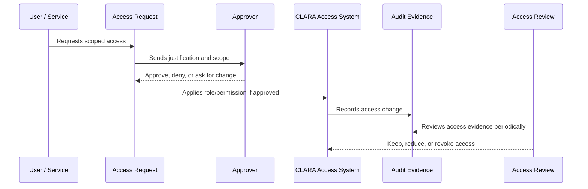

# Role Governance Model

> *"Defines how CLARA roles should be created, named, approved, reviewed, changed, and retired."*

---

# Purpose

Defines how CLARA roles should be created, named, approved, reviewed, changed, and retired.

---

# Governance Problem

Role sprawl and unclear role meaning cause over-permissioning and inconsistent authorization behavior.

---

# Governance Decision

## Decision

CLARA roles should be stable, business-readable, least-privilege aligned, and mapped to permissions and product responsibilities.

## Status

Accepted.

---

# Access Governance Rule

Every access decision in CLARA must be governed as:

```text
Identity -> Scope -> Role -> Permission -> Approval -> Evidence -> Review
```

No protected capability should exist without:

```text
owner
risk level
scope
approval path
audit evidence
review cadence
revocation path
```

---

# Recommended Governance Flow



---

# Secure-by-Design Checklist

- [ ] Identity owner is clear.
- [ ] Scope is clear.
- [ ] Role is appropriate.
- [ ] Permission risk level is understood.
- [ ] Approval path is defined.
- [ ] Access is time-bound where needed.
- [ ] Audit evidence is generated.
- [ ] Review cadence is defined.
- [ ] Revocation/offboarding path exists.
- [ ] Emergency process is defined where relevant.

---

# Acceptance Criteria

- [ ] Governance process is clear.
- [ ] Owners and approvers are clear.
- [ ] Evidence requirements are clear.
- [ ] Review cadence is clear.
- [ ] Exception process is explicit.
- [ ] Implementation references are aligned with Book V.
- [ ] AI coding assistants can follow this safely.

---

# Anti-patterns

Avoid:

- Shared user accounts.
- Permanent admin access without review.
- Roles with unclear purpose.
- Permissions created without owner or tests.
- Access granted through informal chat only.
- Service accounts with no owner.
- API keys without rotation/revocation plan.
- Break-glass access with no audit.
- Access reviews that do not remove anything.

---

# Related Documents

- ../PART-01-Security-Governance-Foundation/README.md
- ../PART-02-Security-Policies-and-Standards/14-Access-Control-Policy.md
- ../../BOOK-05-Engineering-Execution-Plan/PART-03-Backend-Implementation-Plan/31-Authorization-RBAC-Implementation-Plan.md
- ../../BOOK-05-Engineering-Execution-Plan/PART-08-Security-Implementation-Plan/129-Authorization-and-RBAC-Enforcement.md
- ../../BOOK-04-Product-Domain-Specification/BOOK-04-Master-Index/BOOK-04-PERMISSION-MAP.md

---

# Navigation

**Previous:** `26-Identity-Governance-Model.md`

**Next:** `28-Permission-Lifecycle-Governance.md`

---

# Role Design Rules

Roles should be:

```text
business-readable
least-privilege aligned
stable
mapped to permissions
documented
reviewed
```

---

# Example Role Families

```text
Owner
Admin
Manager
Agent
Viewer
Knowledge Manager
Billing Admin
Security Admin
Integration Admin
```

---

# Role Change Governance

Role changes require:

```text
reason
approver
scope
audit event
review date if elevated
```

---

# Role Sprawl Warning

Do not create a new role for every small exception.

Prefer permissions/entitlements plus documented exceptions when needed.
