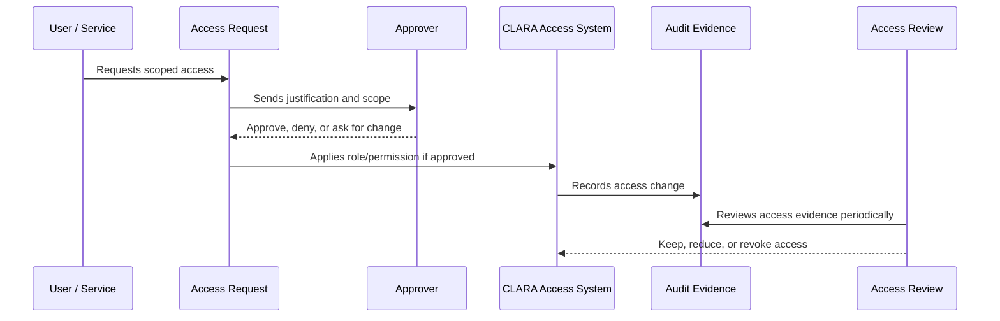

# Service Account and Machine Access Governance

> *"Defines governance for service accounts, API keys, integration credentials, background workers, CI/CD identities, and automation identities."*

---

# Purpose

Defines governance for service accounts, API keys, integration credentials, background workers, CI/CD identities, and automation identities.

---

# Governance Problem

Unowned service accounts and API keys are common long-lived access risks.

---

# Governance Decision

## Decision

Machine identities must have owners, scopes, rotation rules, least privilege, monitoring, and revocation process.

## Status

Accepted.

---

# Access Governance Rule

Every access decision in CLARA must be governed as:

```text
Identity -> Scope -> Role -> Permission -> Approval -> Evidence -> Review
```

No protected capability should exist without:

```text
owner
risk level
scope
approval path
audit evidence
review cadence
revocation path
```

---

# Recommended Governance Flow



---

# Secure-by-Design Checklist

- [ ] Identity owner is clear.
- [ ] Scope is clear.
- [ ] Role is appropriate.
- [ ] Permission risk level is understood.
- [ ] Approval path is defined.
- [ ] Access is time-bound where needed.
- [ ] Audit evidence is generated.
- [ ] Review cadence is defined.
- [ ] Revocation/offboarding path exists.
- [ ] Emergency process is defined where relevant.

---

# Acceptance Criteria

- [ ] Governance process is clear.
- [ ] Owners and approvers are clear.
- [ ] Evidence requirements are clear.
- [ ] Review cadence is clear.
- [ ] Exception process is explicit.
- [ ] Implementation references are aligned with Book V.
- [ ] AI coding assistants can follow this safely.

---

# Anti-patterns

Avoid:

- Shared user accounts.
- Permanent admin access without review.
- Roles with unclear purpose.
- Permissions created without owner or tests.
- Access granted through informal chat only.
- Service accounts with no owner.
- API keys without rotation/revocation plan.
- Break-glass access with no audit.
- Access reviews that do not remove anything.

---

# Related Documents

- ../PART-01-Security-Governance-Foundation/README.md
- ../PART-02-Security-Policies-and-Standards/14-Access-Control-Policy.md
- ../../BOOK-05-Engineering-Execution-Plan/PART-03-Backend-Implementation-Plan/31-Authorization-RBAC-Implementation-Plan.md
- ../../BOOK-05-Engineering-Execution-Plan/PART-08-Security-Implementation-Plan/129-Authorization-and-RBAC-Enforcement.md
- ../../BOOK-04-Product-Domain-Specification/BOOK-04-Master-Index/BOOK-04-PERMISSION-MAP.md

---

# Navigation

**Previous:** `30-Admin-and-Privileged-Access-Governance.md`

**Next:** `32-Access-Request-and-Approval-Workflow.md`

---

# Machine Identity Types

```text
backend worker identity
scheduler identity
integration service account
API key identity
CI/CD deployment identity
monitoring identity
backup/restore identity
```

---

# Governance Requirements

Every machine identity must have:

```text
owner
purpose
scope
least privilege
credential storage method
rotation/revocation process
monitoring
expiration/review date where appropriate
```

---

# API Key Rules

- Store only hashes or secret references.
- Show secret value only once.
- Scope to organization/workspace/integration.
- Support revoke.
- Rate-limit usage.
- Audit creation and revocation.
