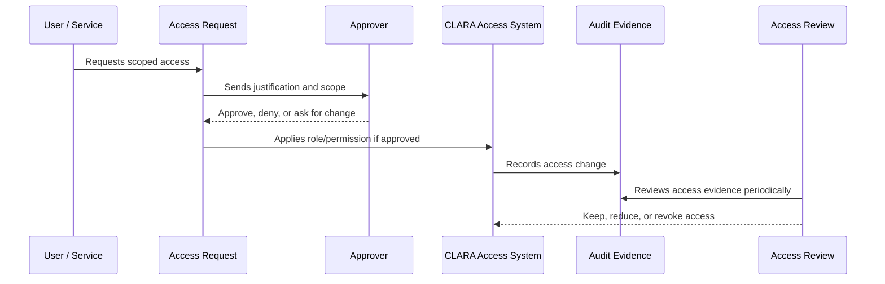

# Access Request and Approval Workflow

> *"Defines how users request access, how approvers evaluate requests, and what evidence is required before access is granted."*

---

# Purpose

Defines how users request access, how approvers evaluate requests, and what evidence is required before access is granted.

---

# Governance Problem

Informal access grants make it hard to prove why someone had access and whether it was appropriate.

---

# Governance Decision

## Decision

CLARA access requests should be explicit, justified, scoped, approved by the right authority, and recorded for audit.

## Status

Accepted.

---

# Access Governance Rule

Every access decision in CLARA must be governed as:

```text
Identity -> Scope -> Role -> Permission -> Approval -> Evidence -> Review
```

No protected capability should exist without:

```text
owner
risk level
scope
approval path
audit evidence
review cadence
revocation path
```

---

# Recommended Governance Flow



---

# Secure-by-Design Checklist

- [ ] Identity owner is clear.
- [ ] Scope is clear.
- [ ] Role is appropriate.
- [ ] Permission risk level is understood.
- [ ] Approval path is defined.
- [ ] Access is time-bound where needed.
- [ ] Audit evidence is generated.
- [ ] Review cadence is defined.
- [ ] Revocation/offboarding path exists.
- [ ] Emergency process is defined where relevant.

---

# Acceptance Criteria

- [ ] Governance process is clear.
- [ ] Owners and approvers are clear.
- [ ] Evidence requirements are clear.
- [ ] Review cadence is clear.
- [ ] Exception process is explicit.
- [ ] Implementation references are aligned with Book V.
- [ ] AI coding assistants can follow this safely.

---

# Anti-patterns

Avoid:

- Shared user accounts.
- Permanent admin access without review.
- Roles with unclear purpose.
- Permissions created without owner or tests.
- Access granted through informal chat only.
- Service accounts with no owner.
- API keys without rotation/revocation plan.
- Break-glass access with no audit.
- Access reviews that do not remove anything.

---

# Related Documents

- ../PART-01-Security-Governance-Foundation/README.md
- ../PART-02-Security-Policies-and-Standards/14-Access-Control-Policy.md
- ../../BOOK-05-Engineering-Execution-Plan/PART-03-Backend-Implementation-Plan/31-Authorization-RBAC-Implementation-Plan.md
- ../../BOOK-05-Engineering-Execution-Plan/PART-08-Security-Implementation-Plan/129-Authorization-and-RBAC-Enforcement.md
- ../../BOOK-04-Product-Domain-Specification/BOOK-04-Master-Index/BOOK-04-PERMISSION-MAP.md

---

# Navigation

**Previous:** `31-Service-Account-and-Machine-Access-Governance.md`

**Next:** `33-Access-Review-and-Recertification.md`

---

# Access Request Fields

A request should include:

```text
requester
requested role/permission
organization/workspace scope
business justification
duration
risk level
approver
date requested
date approved/denied
```

---

# Approval Rules

| Access Type | Approver |
|---|---|
| Normal workspace role | Workspace admin/manager |
| Organization admin | Organization owner/security owner |
| Billing admin | Organization owner/billing owner |
| Security admin | Security owner |
| Integration admin | Organization owner/security owner |
| Production/internal access | Engineering/platform/security owner |

---

# Approval Evidence

Approval should be stored in a ticket, audit log, access request record, or governance checklist.
