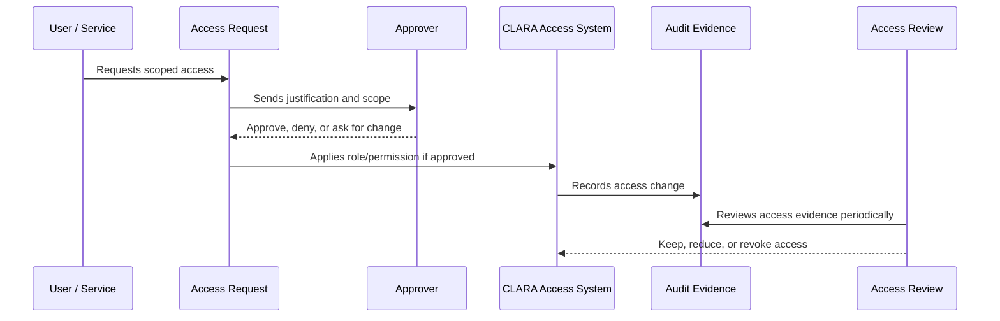

# Access Audit Evidence and Monitoring

> *"Defines audit evidence, monitoring, alerts, and investigation support for access-related actions."*

---

# Purpose

Defines audit evidence, monitoring, alerts, and investigation support for access-related actions.

---

# Governance Problem

Without access evidence, governance cannot prove least privilege, investigate abuse, or satisfy enterprise review.

---

# Governance Decision

## Decision

CLARA should generate and preserve evidence for access grants, role changes, privilege usage, service account activity, and denied access patterns.

## Status

Accepted.

---

# Access Governance Rule

Every access decision in CLARA must be governed as:

```text
Identity -> Scope -> Role -> Permission -> Approval -> Evidence -> Review
```

No protected capability should exist without:

```text
owner
risk level
scope
approval path
audit evidence
review cadence
revocation path
```

---

# Recommended Governance Flow



---

# Secure-by-Design Checklist

- [ ] Identity owner is clear.
- [ ] Scope is clear.
- [ ] Role is appropriate.
- [ ] Permission risk level is understood.
- [ ] Approval path is defined.
- [ ] Access is time-bound where needed.
- [ ] Audit evidence is generated.
- [ ] Review cadence is defined.
- [ ] Revocation/offboarding path exists.
- [ ] Emergency process is defined where relevant.

---

# Acceptance Criteria

- [ ] Governance process is clear.
- [ ] Owners and approvers are clear.
- [ ] Evidence requirements are clear.
- [ ] Review cadence is clear.
- [ ] Exception process is explicit.
- [ ] Implementation references are aligned with Book V.
- [ ] AI coding assistants can follow this safely.

---

# Anti-patterns

Avoid:

- Shared user accounts.
- Permanent admin access without review.
- Roles with unclear purpose.
- Permissions created without owner or tests.
- Access granted through informal chat only.
- Service accounts with no owner.
- API keys without rotation/revocation plan.
- Break-glass access with no audit.
- Access reviews that do not remove anything.

---

# Related Documents

- ../PART-01-Security-Governance-Foundation/README.md
- ../PART-02-Security-Policies-and-Standards/14-Access-Control-Policy.md
- ../../BOOK-05-Engineering-Execution-Plan/PART-03-Backend-Implementation-Plan/31-Authorization-RBAC-Implementation-Plan.md
- ../../BOOK-05-Engineering-Execution-Plan/PART-08-Security-Implementation-Plan/129-Authorization-and-RBAC-Enforcement.md
- ../../BOOK-04-Product-Domain-Specification/BOOK-04-Master-Index/BOOK-04-PERMISSION-MAP.md

---

# Navigation

**Previous:** `34-Emergency-Break-Glass-Access.md`

**Next:** `36-Part-03-Summary.md`

---

# Required Access Audit Events

Audit:

```text
user invited
user activated/deactivated
membership created/updated/removed
role assigned/removed
permission changed
privileged access granted/revoked
service account created/revoked
API key created/revoked
break-glass activated/ended
access review completed
```

---

# Monitoring Signals

Monitor:

```text
failed login spikes
permission denied spikes
admin action spikes
new privileged users
new API keys
break-glass activation
cross-workspace denied access
unusual export attempts
```

---

# Evidence Rule

Access evidence should be searchable by:

```text
actor
target user/service
organization
workspace
role/permission
event type
timestamp
approver
```
