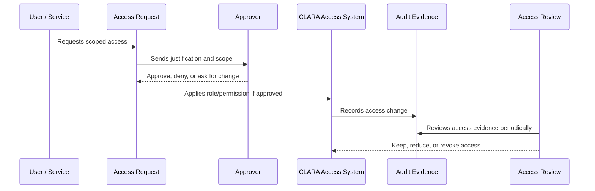

# Part 03 Summary

> *"Summarizes Identity and Access Governance and prepares for Book VI Part 04."*

---

# Purpose

Summarizes Identity and Access Governance and prepares for Book VI Part 04.

---

# Governance Problem

Data protection depends on strong identity and access governance because data controls are only meaningful when access boundaries are trustworthy.

---

# Governance Decision

## Decision

CLARA should proceed to Data Protection and Privacy Governance after identity, roles, permissions, membership, privileged access, machine access, approvals, reviews, break-glass, and access evidence are defined.

## Status

Accepted.

---

# Access Governance Rule

Every access decision in CLARA must be governed as:

```text
Identity -> Scope -> Role -> Permission -> Approval -> Evidence -> Review
```

No protected capability should exist without:

```text
owner
risk level
scope
approval path
audit evidence
review cadence
revocation path
```

---

# Recommended Governance Flow



---

# Secure-by-Design Checklist

- [ ] Identity owner is clear.
- [ ] Scope is clear.
- [ ] Role is appropriate.
- [ ] Permission risk level is understood.
- [ ] Approval path is defined.
- [ ] Access is time-bound where needed.
- [ ] Audit evidence is generated.
- [ ] Review cadence is defined.
- [ ] Revocation/offboarding path exists.
- [ ] Emergency process is defined where relevant.

---

# Acceptance Criteria

- [ ] Governance process is clear.
- [ ] Owners and approvers are clear.
- [ ] Evidence requirements are clear.
- [ ] Review cadence is clear.
- [ ] Exception process is explicit.
- [ ] Implementation references are aligned with Book V.
- [ ] AI coding assistants can follow this safely.

---

# Anti-patterns

Avoid:

- Shared user accounts.
- Permanent admin access without review.
- Roles with unclear purpose.
- Permissions created without owner or tests.
- Access granted through informal chat only.
- Service accounts with no owner.
- API keys without rotation/revocation plan.
- Break-glass access with no audit.
- Access reviews that do not remove anything.

---

# Related Documents

- ../PART-01-Security-Governance-Foundation/README.md
- ../PART-02-Security-Policies-and-Standards/14-Access-Control-Policy.md
- ../../BOOK-05-Engineering-Execution-Plan/PART-03-Backend-Implementation-Plan/31-Authorization-RBAC-Implementation-Plan.md
- ../../BOOK-05-Engineering-Execution-Plan/PART-08-Security-Implementation-Plan/129-Authorization-and-RBAC-Enforcement.md
- ../../BOOK-04-Product-Domain-Specification/BOOK-04-Master-Index/BOOK-04-PERMISSION-MAP.md

---

# Navigation

**Previous:** `35-Access-Audit-Evidence-and-Monitoring.md`

**Next:** `../PART-04-Data-Protection-and-Privacy-Governance/README.md`

---

# Part 03 Completion

Part 03 establishes:

- Identity and access governance overview.
- Identity governance model.
- Role governance model.
- Permission lifecycle governance.
- Membership lifecycle governance.
- Admin and privileged access governance.
- Service account and machine access governance.
- Access request and approval workflow.
- Access review and recertification.
- Emergency break-glass access.
- Access audit evidence and monitoring.

---

# Ready for Part 04

The next part should be:

```text
BOOK VI — PART 04: Data Protection and Privacy Governance
```

It should define:

- Data classification.
- Data inventory.
- Data ownership.
- PII handling.
- Conversation/internal note privacy.
- AI data privacy.
- Data retention and deletion governance.
- Export governance.
- Attachment/media data governance.
- Privacy review process.
- Data protection evidence.
