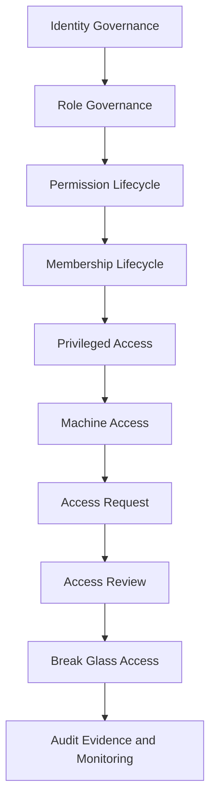

# PART-03 — Identity and Access Governance

> *"Access is not just a login problem. Access is a governance system that decides who can affect CLARA's trust boundary."*

---

# Purpose

Part 03 defines CLARA's identity and access governance layer.

It covers:

- Identity and Access Governance overview.
- Identity Governance Model.
- Role Governance Model.
- Permission Lifecycle Governance.
- Membership Lifecycle Governance.
- Admin and Privileged Access Governance.
- Service Account and Machine Access Governance.
- Access Request and Approval Workflow.
- Access Review and Recertification.
- Emergency Break Glass Access.
- Access Audit Evidence and Monitoring.

---

# Chapter Map

| Chapter | Title |
|---:|---|
| 25 | Identity and Access Governance Overview |
| 26 | Identity Governance Model |
| 27 | Role Governance Model |
| 28 | Permission Lifecycle Governance |
| 29 | Membership Lifecycle Governance |
| 30 | Admin and Privileged Access Governance |
| 31 | Service Account and Machine Access Governance |
| 32 | Access Request and Approval Workflow |
| 33 | Access Review and Recertification |
| 34 | Emergency Break Glass Access |
| 35 | Access Audit Evidence and Monitoring |
| 36 | Part 03 Summary |

---

# Identity and Access Governance Map



---

# Governance Non-Negotiables

CLARA identity and access governance must enforce:

```text
least privilege
server-side authorization
organization/workspace scope
named owners for privileged access
periodic access reviews
role and permission lifecycle control
no permanent unowned service accounts
no informal admin grants
break-glass access with evidence
audit logs for sensitive access changes
```

---

# Relationship to Book V

Book V defines:

```text
how auth, RBAC, scope, and audit are implemented
```

Book VI Part 03 defines:

```text
how those access controls are governed, reviewed, approved, and evidenced
```

---

# Navigation

**Previous:** `../PART-02-Security-Policies-and-Standards/24-Part-02-Summary.md`

**Next:** `25-Identity-and-Access-Governance-Overview.md`
