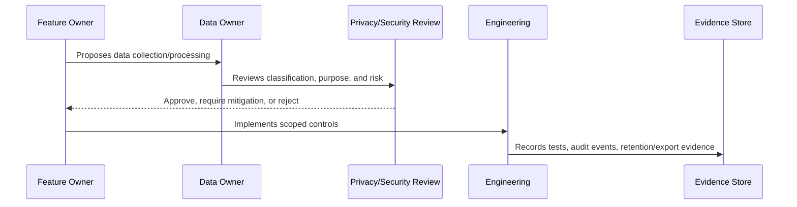

# Data Protection and Privacy Governance Overview

> *"Introduces CLARA's governance model for protecting customer data, conversation data, internal notes, AI context, attachments, exports, retention, and privacy evidence."*

---

# Purpose

Introduces CLARA's governance model for protecting customer data, conversation data, internal notes, AI context, attachments, exports, retention, and privacy evidence.

---

# Governance Problem

Without data governance, CLARA may collect too much data, expose sensitive records, retain data too long, or use customer data in unsafe AI/integration workflows.

---

# Governance Decision

## Decision

CLARA data protection governance should define how data is classified, owned, accessed, minimized, retained, exported, deleted, reviewed, and evidenced.

## Status

Accepted.

---

# Data Governance Rule

Every important CLARA data category must be governed as:

```text
Data Category -> Classification -> Owner -> Purpose -> Access Scope -> Retention -> Evidence
```

No sensitive data flow should exist without:

```text
owner
classification
legal/business purpose
access boundary
retention rule
export rule
audit/evidence source
```

---

# Recommended Governance Flow



---

# Secure-by-Design Checklist

- [ ] Data category is identified.
- [ ] Classification is assigned.
- [ ] Owner is assigned.
- [ ] Processing purpose is documented.
- [ ] Organization/workspace scope is defined.
- [ ] Access controls are defined.
- [ ] Retention/deletion behavior is defined.
- [ ] Export behavior is defined.
- [ ] AI/integration usage is reviewed if relevant.
- [ ] Evidence source is defined.
- [ ] Privacy risk is documented.

---

# Acceptance Criteria

- [ ] Governance process is clear.
- [ ] Data owner is clear.
- [ ] Data classification is clear.
- [ ] Access and retention expectations are clear.
- [ ] Export and AI usage expectations are clear where relevant.
- [ ] Evidence requirements are clear.
- [ ] AI coding assistants can follow this safely.

---

# Anti-patterns

Avoid:

- Collecting data without purpose.
- Keeping customer data forever by default.
- Using production customer data in development.
- Treating internal notes as normal customer-visible text.
- Sending full conversation history to AI by default.
- Exporting data without audit.
- Storing raw attachments without access control.
- Logging raw customer content unnecessarily.
- Leaving data ownership undefined.

---

# Related Documents

- ../PART-02-Security-Policies-and-Standards/15-Data-Protection-and-Privacy-Policy.md
- ../PART-03-Identity-and-Access-Governance/README.md
- ../../BOOK-05-Engineering-Execution-Plan/PART-05-Database-and-Migration-Plan/README.md
- ../../BOOK-05-Engineering-Execution-Plan/PART-06-AI-Implementation-Plan/README.md
- ../../BOOK-05-Engineering-Execution-Plan/PART-08-Security-Implementation-Plan/README.md
- ../../BOOK-04-Product-Domain-Specification/BOOK-04-Master-Index/BOOK-04-AI-GOVERNANCE-MAP.md

---

# Navigation

**Previous:** `../PART-03-Identity-and-Access-Governance/36-Part-03-Summary.md`

**Next:** `38-Data-Classification-Model.md`

---

# Data Governance Scope

CLARA data protection governance covers:

```text
customer profiles
contact points
conversation messages
internal notes
tickets
knowledge articles
AI prompts/context/outputs
integration payload metadata
attachments/media
audit logs
analytics data
exports
settings and admin records
```

---

# Core Questions

For every data category, CLARA should answer:

```text
What is this data?
Why do we collect it?
Who owns it?
Who can access it?
Can AI use it?
Can integrations receive it?
How long do we keep it?
Can it be exported?
How can it be deleted?
What evidence proves controls work?
```
