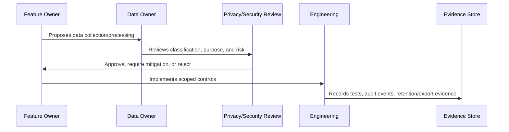

# Data Classification Model

> *"Defines CLARA's data classification model for public, internal, confidential, restricted, sensitive personal data, secrets, and regulated data categories."*

---

# Purpose

Defines CLARA's data classification model for public, internal, confidential, restricted, sensitive personal data, secrets, and regulated data categories.

---

# Governance Problem

Security controls become inconsistent when the team does not agree which data is sensitive and how strongly it must be protected.

---

# Governance Decision

## Decision

CLARA should classify data based on sensitivity, access risk, privacy impact, business impact, and compliance expectations.

## Status

Accepted.

---

# Data Governance Rule

Every important CLARA data category must be governed as:

```text
Data Category -> Classification -> Owner -> Purpose -> Access Scope -> Retention -> Evidence
```

No sensitive data flow should exist without:

```text
owner
classification
legal/business purpose
access boundary
retention rule
export rule
audit/evidence source
```

---

# Recommended Governance Flow



---

# Secure-by-Design Checklist

- [ ] Data category is identified.
- [ ] Classification is assigned.
- [ ] Owner is assigned.
- [ ] Processing purpose is documented.
- [ ] Organization/workspace scope is defined.
- [ ] Access controls are defined.
- [ ] Retention/deletion behavior is defined.
- [ ] Export behavior is defined.
- [ ] AI/integration usage is reviewed if relevant.
- [ ] Evidence source is defined.
- [ ] Privacy risk is documented.

---

# Acceptance Criteria

- [ ] Governance process is clear.
- [ ] Data owner is clear.
- [ ] Data classification is clear.
- [ ] Access and retention expectations are clear.
- [ ] Export and AI usage expectations are clear where relevant.
- [ ] Evidence requirements are clear.
- [ ] AI coding assistants can follow this safely.

---

# Anti-patterns

Avoid:

- Collecting data without purpose.
- Keeping customer data forever by default.
- Using production customer data in development.
- Treating internal notes as normal customer-visible text.
- Sending full conversation history to AI by default.
- Exporting data without audit.
- Storing raw attachments without access control.
- Logging raw customer content unnecessarily.
- Leaving data ownership undefined.

---

# Related Documents

- ../PART-02-Security-Policies-and-Standards/15-Data-Protection-and-Privacy-Policy.md
- ../PART-03-Identity-and-Access-Governance/README.md
- ../../BOOK-05-Engineering-Execution-Plan/PART-05-Database-and-Migration-Plan/README.md
- ../../BOOK-05-Engineering-Execution-Plan/PART-06-AI-Implementation-Plan/README.md
- ../../BOOK-05-Engineering-Execution-Plan/PART-08-Security-Implementation-Plan/README.md
- ../../BOOK-04-Product-Domain-Specification/BOOK-04-Master-Index/BOOK-04-AI-GOVERNANCE-MAP.md

---

# Navigation

**Previous:** `37-Data-Protection-and-Privacy-Governance-Overview.md`

**Next:** `39-Data-Inventory-and-Ownership.md`

---

# Data Classification Levels

Recommended classification:

| Level | Description | Examples |
|---|---|---|
| Public | Safe to disclose publicly | Public docs, public marketing text |
| Internal | Internal business info | internal roadmap, non-sensitive ops notes |
| Confidential | Business/customer data requiring access control | CRM records, tickets, analytics |
| Restricted | Highly sensitive operational or security data | internal notes, audit logs, admin configs |
| Sensitive Personal Data | PII or privacy-sensitive customer/user info | emails, phone numbers, message contents |
| Secret | Credentials and cryptographic material | API keys, tokens, webhook secrets |

---

# Classification Rule

When uncertain, classify data at the higher sensitivity level until reviewed.

---

# Control Mapping

Higher classification requires stronger:

```text
access control
logging restrictions
retention discipline
export approval
audit evidence
review cadence
```
