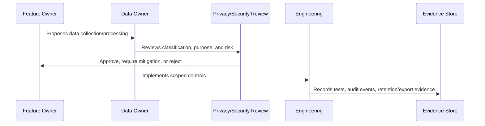

# Data Inventory and Ownership

> *"Defines governance for data inventory, data owners, data stewards, data processors, systems of record, and data flow mapping."*

---

# Purpose

Defines governance for data inventory, data owners, data stewards, data processors, systems of record, and data flow mapping.

---

# Governance Problem

Teams cannot protect data they cannot locate, classify, or assign ownership to.

---

# Governance Decision

## Decision

Every important CLARA data category should have an owner, storage location, processing purpose, retention expectation, and access model.

## Status

Accepted.

---

# Data Governance Rule

Every important CLARA data category must be governed as:

```text
Data Category -> Classification -> Owner -> Purpose -> Access Scope -> Retention -> Evidence
```

No sensitive data flow should exist without:

```text
owner
classification
legal/business purpose
access boundary
retention rule
export rule
audit/evidence source
```

---

# Recommended Governance Flow



---

# Secure-by-Design Checklist

- [ ] Data category is identified.
- [ ] Classification is assigned.
- [ ] Owner is assigned.
- [ ] Processing purpose is documented.
- [ ] Organization/workspace scope is defined.
- [ ] Access controls are defined.
- [ ] Retention/deletion behavior is defined.
- [ ] Export behavior is defined.
- [ ] AI/integration usage is reviewed if relevant.
- [ ] Evidence source is defined.
- [ ] Privacy risk is documented.

---

# Acceptance Criteria

- [ ] Governance process is clear.
- [ ] Data owner is clear.
- [ ] Data classification is clear.
- [ ] Access and retention expectations are clear.
- [ ] Export and AI usage expectations are clear where relevant.
- [ ] Evidence requirements are clear.
- [ ] AI coding assistants can follow this safely.

---

# Anti-patterns

Avoid:

- Collecting data without purpose.
- Keeping customer data forever by default.
- Using production customer data in development.
- Treating internal notes as normal customer-visible text.
- Sending full conversation history to AI by default.
- Exporting data without audit.
- Storing raw attachments without access control.
- Logging raw customer content unnecessarily.
- Leaving data ownership undefined.

---

# Related Documents

- ../PART-02-Security-Policies-and-Standards/15-Data-Protection-and-Privacy-Policy.md
- ../PART-03-Identity-and-Access-Governance/README.md
- ../../BOOK-05-Engineering-Execution-Plan/PART-05-Database-and-Migration-Plan/README.md
- ../../BOOK-05-Engineering-Execution-Plan/PART-06-AI-Implementation-Plan/README.md
- ../../BOOK-05-Engineering-Execution-Plan/PART-08-Security-Implementation-Plan/README.md
- ../../BOOK-04-Product-Domain-Specification/BOOK-04-Master-Index/BOOK-04-AI-GOVERNANCE-MAP.md

---

# Navigation

**Previous:** `38-Data-Classification-Model.md`

**Next:** `40-PII-and-Customer-Data-Handling.md`

---

# Data Inventory Fields

Track:

```text
data category
description
classification
system/table/location
owner
business purpose
source
destination
AI usage allowed
integration sharing allowed
retention rule
export rule
deletion rule
evidence source
```

---

# Ownership Roles

| Role | Responsibility |
|---|---|
| Data Owner | Accountable for data category decisions |
| Data Steward | Maintains quality, lifecycle, and documentation |
| System Owner | Owns technical storage/processing system |
| Security Owner | Reviews protection controls |
| Privacy Owner | Reviews privacy impact where needed |

---

# Inventory Rule

If a feature introduces a new sensitive data category, the inventory must be updated.
