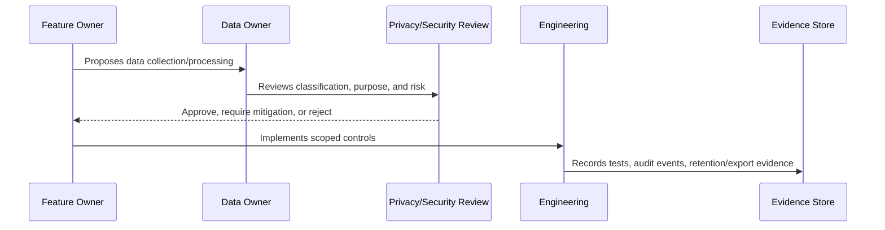

# PII and Customer Data Handling

> *"Defines governance for personally identifiable information, customer profiles, contact points, customer notes, tags, timeline events, and CRM records."*

---

# Purpose

Defines governance for personally identifiable information, customer profiles, contact points, customer notes, tags, timeline events, and CRM records.

---

# Governance Problem

Customer data is high-trust data; mishandling it can create privacy incidents and damage product trust.

---

# Governance Decision

## Decision

CLARA customer data should be collected minimally, scoped to organization/workspace access, protected by RBAC, and handled with privacy-aware defaults.

## Status

Accepted.

---

# Data Governance Rule

Every important CLARA data category must be governed as:

```text
Data Category -> Classification -> Owner -> Purpose -> Access Scope -> Retention -> Evidence
```

No sensitive data flow should exist without:

```text
owner
classification
legal/business purpose
access boundary
retention rule
export rule
audit/evidence source
```

---

# Recommended Governance Flow



---

# Secure-by-Design Checklist

- [ ] Data category is identified.
- [ ] Classification is assigned.
- [ ] Owner is assigned.
- [ ] Processing purpose is documented.
- [ ] Organization/workspace scope is defined.
- [ ] Access controls are defined.
- [ ] Retention/deletion behavior is defined.
- [ ] Export behavior is defined.
- [ ] AI/integration usage is reviewed if relevant.
- [ ] Evidence source is defined.
- [ ] Privacy risk is documented.

---

# Acceptance Criteria

- [ ] Governance process is clear.
- [ ] Data owner is clear.
- [ ] Data classification is clear.
- [ ] Access and retention expectations are clear.
- [ ] Export and AI usage expectations are clear where relevant.
- [ ] Evidence requirements are clear.
- [ ] AI coding assistants can follow this safely.

---

# Anti-patterns

Avoid:

- Collecting data without purpose.
- Keeping customer data forever by default.
- Using production customer data in development.
- Treating internal notes as normal customer-visible text.
- Sending full conversation history to AI by default.
- Exporting data without audit.
- Storing raw attachments without access control.
- Logging raw customer content unnecessarily.
- Leaving data ownership undefined.

---

# Related Documents

- ../PART-02-Security-Policies-and-Standards/15-Data-Protection-and-Privacy-Policy.md
- ../PART-03-Identity-and-Access-Governance/README.md
- ../../BOOK-05-Engineering-Execution-Plan/PART-05-Database-and-Migration-Plan/README.md
- ../../BOOK-05-Engineering-Execution-Plan/PART-06-AI-Implementation-Plan/README.md
- ../../BOOK-05-Engineering-Execution-Plan/PART-08-Security-Implementation-Plan/README.md
- ../../BOOK-04-Product-Domain-Specification/BOOK-04-Master-Index/BOOK-04-AI-GOVERNANCE-MAP.md

---

# Navigation

**Previous:** `39-Data-Inventory-and-Ownership.md`

**Next:** `41-Conversation-and-Internal-Note-Privacy.md`

---

# PII Examples

PII/customer data may include:

```text
name
email
phone number
social handle
address
customer notes
conversation content
purchase/lead context
support history
attachments containing personal info
```

---

# Handling Rules

- Collect only what is needed.
- Validate and normalize contact points.
- Scope all customer records by organization/workspace.
- Restrict export permissions.
- Redact logs.
- Avoid sending unnecessary PII to AI/providers.
- Do not use real PII in tests, fixtures, screenshots, or demos.

---

# Customer Data Evidence

Evidence may include:

```text
scope tests
export audit logs
PII redaction tests
data inventory entries
retention review records
```
