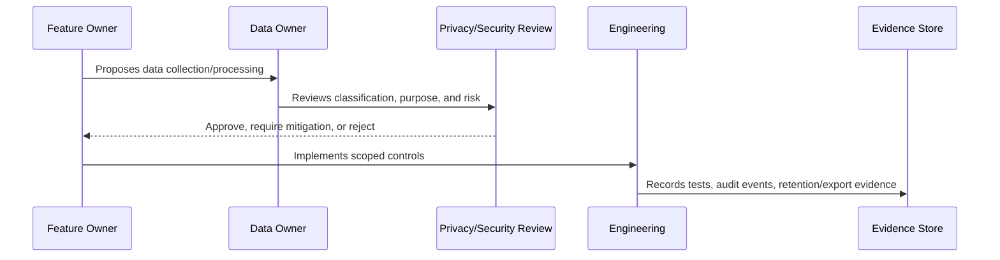

# Conversation and Internal Note Privacy

> *"Defines governance for conversation messages, customer-visible replies, internal notes, attachments, assignments, and message metadata."*

---

# Purpose

Defines governance for conversation messages, customer-visible replies, internal notes, attachments, assignments, and message metadata.

---

# Governance Problem

Internal notes can contain sensitive business context and must never accidentally become customer-visible or AI/provider-exposed without governance.

---

# Governance Decision

## Decision

CLARA must clearly separate customer-visible communication from internal operational notes and apply stricter governance to internal notes.

## Status

Accepted.

---

# Data Governance Rule

Every important CLARA data category must be governed as:

```text
Data Category -> Classification -> Owner -> Purpose -> Access Scope -> Retention -> Evidence
```

No sensitive data flow should exist without:

```text
owner
classification
legal/business purpose
access boundary
retention rule
export rule
audit/evidence source
```

---

# Recommended Governance Flow



---

# Secure-by-Design Checklist

- [ ] Data category is identified.
- [ ] Classification is assigned.
- [ ] Owner is assigned.
- [ ] Processing purpose is documented.
- [ ] Organization/workspace scope is defined.
- [ ] Access controls are defined.
- [ ] Retention/deletion behavior is defined.
- [ ] Export behavior is defined.
- [ ] AI/integration usage is reviewed if relevant.
- [ ] Evidence source is defined.
- [ ] Privacy risk is documented.

---

# Acceptance Criteria

- [ ] Governance process is clear.
- [ ] Data owner is clear.
- [ ] Data classification is clear.
- [ ] Access and retention expectations are clear.
- [ ] Export and AI usage expectations are clear where relevant.
- [ ] Evidence requirements are clear.
- [ ] AI coding assistants can follow this safely.

---

# Anti-patterns

Avoid:

- Collecting data without purpose.
- Keeping customer data forever by default.
- Using production customer data in development.
- Treating internal notes as normal customer-visible text.
- Sending full conversation history to AI by default.
- Exporting data without audit.
- Storing raw attachments without access control.
- Logging raw customer content unnecessarily.
- Leaving data ownership undefined.

---

# Related Documents

- ../PART-02-Security-Policies-and-Standards/15-Data-Protection-and-Privacy-Policy.md
- ../PART-03-Identity-and-Access-Governance/README.md
- ../../BOOK-05-Engineering-Execution-Plan/PART-05-Database-and-Migration-Plan/README.md
- ../../BOOK-05-Engineering-Execution-Plan/PART-06-AI-Implementation-Plan/README.md
- ../../BOOK-05-Engineering-Execution-Plan/PART-08-Security-Implementation-Plan/README.md
- ../../BOOK-04-Product-Domain-Specification/BOOK-04-Master-Index/BOOK-04-AI-GOVERNANCE-MAP.md

---

# Navigation

**Previous:** `40-PII-and-Customer-Data-Handling.md`

**Next:** `42-AI-Data-Privacy-and-Context-Governance.md`

---

# Conversation Privacy Rules

Conversation data includes:

```text
customer messages
agent replies
message metadata
assignments
statuses
internal notes
attachments
AI drafts linked to conversations
```

---

# Internal Note Rules

Internal notes must be:

```text
visually distinct
not sent to customers
not included in outbound channel payloads
not included in AI context unless explicitly allowed
permission-controlled
audited when sensitive
```

---

# Customer-Visible Separation

Every channel/inbox implementation must preserve the boundary:

```text
internal operational content != customer-visible communication
```
