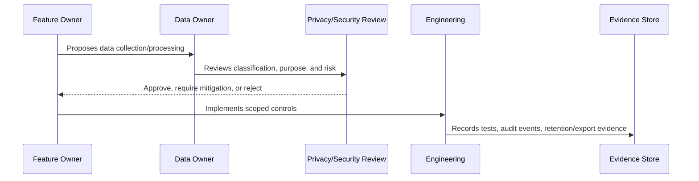

# AI Data Privacy and Context Governance

> *"Defines governance for AI prompts, context assembly, RAG sources, AI outputs, feedback, model provider data handling, and AI retention."*

---

# Purpose

Defines governance for AI prompts, context assembly, RAG sources, AI outputs, feedback, model provider data handling, and AI retention.

---

# Governance Problem

AI features can accidentally expose sensitive data to model providers, logs, prompts, outputs, or unauthorized users.

---

# Governance Decision

## Decision

CLARA AI data governance must minimize context, enforce access boundaries, use eligible sources only, label AI outputs, and retain only necessary AI metadata/content.

## Status

Accepted.

---

# Data Governance Rule

Every important CLARA data category must be governed as:

```text
Data Category -> Classification -> Owner -> Purpose -> Access Scope -> Retention -> Evidence
```

No sensitive data flow should exist without:

```text
owner
classification
legal/business purpose
access boundary
retention rule
export rule
audit/evidence source
```

---

# Recommended Governance Flow



---

# Secure-by-Design Checklist

- [ ] Data category is identified.
- [ ] Classification is assigned.
- [ ] Owner is assigned.
- [ ] Processing purpose is documented.
- [ ] Organization/workspace scope is defined.
- [ ] Access controls are defined.
- [ ] Retention/deletion behavior is defined.
- [ ] Export behavior is defined.
- [ ] AI/integration usage is reviewed if relevant.
- [ ] Evidence source is defined.
- [ ] Privacy risk is documented.

---

# Acceptance Criteria

- [ ] Governance process is clear.
- [ ] Data owner is clear.
- [ ] Data classification is clear.
- [ ] Access and retention expectations are clear.
- [ ] Export and AI usage expectations are clear where relevant.
- [ ] Evidence requirements are clear.
- [ ] AI coding assistants can follow this safely.

---

# Anti-patterns

Avoid:

- Collecting data without purpose.
- Keeping customer data forever by default.
- Using production customer data in development.
- Treating internal notes as normal customer-visible text.
- Sending full conversation history to AI by default.
- Exporting data without audit.
- Storing raw attachments without access control.
- Logging raw customer content unnecessarily.
- Leaving data ownership undefined.

---

# Related Documents

- ../PART-02-Security-Policies-and-Standards/15-Data-Protection-and-Privacy-Policy.md
- ../PART-03-Identity-and-Access-Governance/README.md
- ../../BOOK-05-Engineering-Execution-Plan/PART-05-Database-and-Migration-Plan/README.md
- ../../BOOK-05-Engineering-Execution-Plan/PART-06-AI-Implementation-Plan/README.md
- ../../BOOK-05-Engineering-Execution-Plan/PART-08-Security-Implementation-Plan/README.md
- ../../BOOK-04-Product-Domain-Specification/BOOK-04-Master-Index/BOOK-04-AI-GOVERNANCE-MAP.md

---

# Navigation

**Previous:** `41-Conversation-and-Internal-Note-Privacy.md`

**Next:** `43-Data-Retention-and-Deletion-Governance.md`

---

# AI Data Categories

AI-related data includes:

```text
prompt templates
prompt variables
conversation context
customer context
retrieved knowledge
AI output
AI feedback
AI review decisions
AI usage metadata
provider request metadata
```

---

# AI Privacy Rules

- Build context from authorized resources only.
- Minimize context.
- Prefer references/summaries over full raw history where practical.
- Use published/eligible knowledge by default.
- Avoid sending secrets to AI providers.
- Retain AI metadata by default; retain full prompt/output only when justified.
- Label and review customer-visible AI output.

---

# AI Privacy Evidence

Evidence may include:

```text
context boundary tests
RAG eligibility tests
prompt template version records
AI audit metadata
review decisions
usage logs
```
