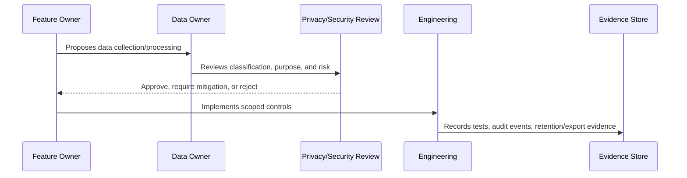

# Data Retention and Deletion Governance

> *"Defines governance for retention windows, archive, soft delete, hard delete, legal hold, deletion requests, and retention exceptions."*

---

# Purpose

Defines governance for retention windows, archive, soft delete, hard delete, legal hold, deletion requests, and retention exceptions.

---

# Governance Problem

Keeping everything forever increases privacy risk, but deleting too aggressively can break audit, support, and recovery needs.

---

# Governance Decision

## Decision

CLARA should define retention and deletion behavior per data category and preserve auditability while respecting privacy requirements.

## Status

Accepted.

---

# Data Governance Rule

Every important CLARA data category must be governed as:

```text
Data Category -> Classification -> Owner -> Purpose -> Access Scope -> Retention -> Evidence
```

No sensitive data flow should exist without:

```text
owner
classification
legal/business purpose
access boundary
retention rule
export rule
audit/evidence source
```

---

# Recommended Governance Flow



---

# Secure-by-Design Checklist

- [ ] Data category is identified.
- [ ] Classification is assigned.
- [ ] Owner is assigned.
- [ ] Processing purpose is documented.
- [ ] Organization/workspace scope is defined.
- [ ] Access controls are defined.
- [ ] Retention/deletion behavior is defined.
- [ ] Export behavior is defined.
- [ ] AI/integration usage is reviewed if relevant.
- [ ] Evidence source is defined.
- [ ] Privacy risk is documented.

---

# Acceptance Criteria

- [ ] Governance process is clear.
- [ ] Data owner is clear.
- [ ] Data classification is clear.
- [ ] Access and retention expectations are clear.
- [ ] Export and AI usage expectations are clear where relevant.
- [ ] Evidence requirements are clear.
- [ ] AI coding assistants can follow this safely.

---

# Anti-patterns

Avoid:

- Collecting data without purpose.
- Keeping customer data forever by default.
- Using production customer data in development.
- Treating internal notes as normal customer-visible text.
- Sending full conversation history to AI by default.
- Exporting data without audit.
- Storing raw attachments without access control.
- Logging raw customer content unnecessarily.
- Leaving data ownership undefined.

---

# Related Documents

- ../PART-02-Security-Policies-and-Standards/15-Data-Protection-and-Privacy-Policy.md
- ../PART-03-Identity-and-Access-Governance/README.md
- ../../BOOK-05-Engineering-Execution-Plan/PART-05-Database-and-Migration-Plan/README.md
- ../../BOOK-05-Engineering-Execution-Plan/PART-06-AI-Implementation-Plan/README.md
- ../../BOOK-05-Engineering-Execution-Plan/PART-08-Security-Implementation-Plan/README.md
- ../../BOOK-04-Product-Domain-Specification/BOOK-04-Master-Index/BOOK-04-AI-GOVERNANCE-MAP.md

---

# Navigation

**Previous:** `42-AI-Data-Privacy-and-Context-Governance.md`

**Next:** `44-Data-Export-and-Portability-Governance.md`

---

# Retention Categories

Define retention for:

```text
customer records
conversation messages
internal notes
tickets
knowledge articles
AI outputs/metadata
webhook payload metadata
attachments
audit logs
exports
analytics aggregates
```

---

# Deletion Types

Use:

```text
archive
soft delete
hard delete
anonymization
redaction
legal hold
```

---

# Governance Rule

Retention must balance:

```text
privacy risk
support value
audit needs
legal/compliance needs
business analytics
storage cost
```

---

# Deletion Evidence

Deletion/retention jobs should produce evidence such as:

```text
job run logs
counts processed
error summary
audit event
owner review
```
