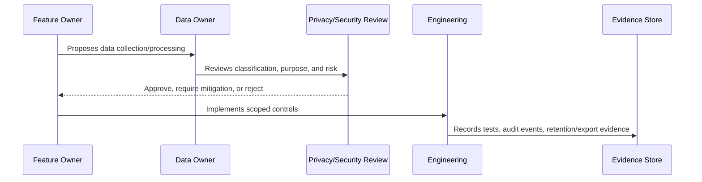

# Attachment and Media Data Governance

> *"Defines governance for uploaded files, external media, screenshots, documents, file metadata, malware risk, access control, previews, and retention."*

---

# Purpose

Defines governance for uploaded files, external media, screenshots, documents, file metadata, malware risk, access control, previews, and retention.

---

# Governance Problem

Files can contain malware, sensitive data, oversized payloads, hidden metadata, or browser-executable content.

---

# Governance Decision

## Decision

CLARA attachments and media should be treated as untrusted protected data with access checks, safe storage, controlled preview/download, and retention rules.

## Status

Accepted.

---

# Data Governance Rule

Every important CLARA data category must be governed as:

```text
Data Category -> Classification -> Owner -> Purpose -> Access Scope -> Retention -> Evidence
```

No sensitive data flow should exist without:

```text
owner
classification
legal/business purpose
access boundary
retention rule
export rule
audit/evidence source
```

---

# Recommended Governance Flow



---

# Secure-by-Design Checklist

- [ ] Data category is identified.
- [ ] Classification is assigned.
- [ ] Owner is assigned.
- [ ] Processing purpose is documented.
- [ ] Organization/workspace scope is defined.
- [ ] Access controls are defined.
- [ ] Retention/deletion behavior is defined.
- [ ] Export behavior is defined.
- [ ] AI/integration usage is reviewed if relevant.
- [ ] Evidence source is defined.
- [ ] Privacy risk is documented.

---

# Acceptance Criteria

- [ ] Governance process is clear.
- [ ] Data owner is clear.
- [ ] Data classification is clear.
- [ ] Access and retention expectations are clear.
- [ ] Export and AI usage expectations are clear where relevant.
- [ ] Evidence requirements are clear.
- [ ] AI coding assistants can follow this safely.

---

# Anti-patterns

Avoid:

- Collecting data without purpose.
- Keeping customer data forever by default.
- Using production customer data in development.
- Treating internal notes as normal customer-visible text.
- Sending full conversation history to AI by default.
- Exporting data without audit.
- Storing raw attachments without access control.
- Logging raw customer content unnecessarily.
- Leaving data ownership undefined.

---

# Related Documents

- ../PART-02-Security-Policies-and-Standards/15-Data-Protection-and-Privacy-Policy.md
- ../PART-03-Identity-and-Access-Governance/README.md
- ../../BOOK-05-Engineering-Execution-Plan/PART-05-Database-and-Migration-Plan/README.md
- ../../BOOK-05-Engineering-Execution-Plan/PART-06-AI-Implementation-Plan/README.md
- ../../BOOK-05-Engineering-Execution-Plan/PART-08-Security-Implementation-Plan/README.md
- ../../BOOK-04-Product-Domain-Specification/BOOK-04-Master-Index/BOOK-04-AI-GOVERNANCE-MAP.md

---

# Navigation

**Previous:** `44-Data-Export-and-Portability-Governance.md`

**Next:** `46-Privacy-Review-and-DPIA-Lite-Process.md`

---

# Attachment Data Risks

Attachments/media may contain:

```text
PII
contracts
screenshots
financial info
malware
HTML/JS content
hidden metadata
large payloads
```

---

# Governance Rules

- Treat attachments as untrusted.
- Enforce upload size/type limits.
- Store with access controls.
- Use authenticated or signed access.
- Avoid unsafe inline previews.
- Scan for malware where practical.
- Retain/delete according to data category.
- Audit sensitive download/export where needed.

---

# Preview Warning

Never serve uploaded HTML/SVG/JS-like content inline without strong controls.
