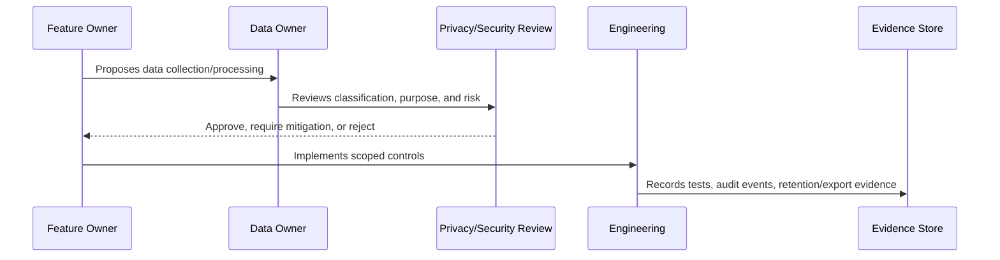

# Privacy Review and DPIA Lite Process

> *"Defines lightweight privacy review process for high-risk data changes, AI features, integrations, exports, analytics, and retention changes."*

---

# Purpose

Defines lightweight privacy review process for high-risk data changes, AI features, integrations, exports, analytics, and retention changes.

---

# Governance Problem

Privacy risk is easiest to reduce before the feature is built and hardest after data is already collected.

---

# Governance Decision

## Decision

CLARA should perform lightweight privacy impact review before launching features that collect, process, export, share, or retain sensitive data.

## Status

Accepted.

---

# Data Governance Rule

Every important CLARA data category must be governed as:

```text
Data Category -> Classification -> Owner -> Purpose -> Access Scope -> Retention -> Evidence
```

No sensitive data flow should exist without:

```text
owner
classification
legal/business purpose
access boundary
retention rule
export rule
audit/evidence source
```

---

# Recommended Governance Flow



---

# Secure-by-Design Checklist

- [ ] Data category is identified.
- [ ] Classification is assigned.
- [ ] Owner is assigned.
- [ ] Processing purpose is documented.
- [ ] Organization/workspace scope is defined.
- [ ] Access controls are defined.
- [ ] Retention/deletion behavior is defined.
- [ ] Export behavior is defined.
- [ ] AI/integration usage is reviewed if relevant.
- [ ] Evidence source is defined.
- [ ] Privacy risk is documented.

---

# Acceptance Criteria

- [ ] Governance process is clear.
- [ ] Data owner is clear.
- [ ] Data classification is clear.
- [ ] Access and retention expectations are clear.
- [ ] Export and AI usage expectations are clear where relevant.
- [ ] Evidence requirements are clear.
- [ ] AI coding assistants can follow this safely.

---

# Anti-patterns

Avoid:

- Collecting data without purpose.
- Keeping customer data forever by default.
- Using production customer data in development.
- Treating internal notes as normal customer-visible text.
- Sending full conversation history to AI by default.
- Exporting data without audit.
- Storing raw attachments without access control.
- Logging raw customer content unnecessarily.
- Leaving data ownership undefined.

---

# Related Documents

- ../PART-02-Security-Policies-and-Standards/15-Data-Protection-and-Privacy-Policy.md
- ../PART-03-Identity-and-Access-Governance/README.md
- ../../BOOK-05-Engineering-Execution-Plan/PART-05-Database-and-Migration-Plan/README.md
- ../../BOOK-05-Engineering-Execution-Plan/PART-06-AI-Implementation-Plan/README.md
- ../../BOOK-05-Engineering-Execution-Plan/PART-08-Security-Implementation-Plan/README.md
- ../../BOOK-04-Product-Domain-Specification/BOOK-04-Master-Index/BOOK-04-AI-GOVERNANCE-MAP.md

---

# Navigation

**Previous:** `45-Attachment-and-Media-Data-Governance.md`

**Next:** `47-Data-Protection-Evidence-and-Monitoring.md`

---

# DPIA-Lite Trigger Events

Perform privacy review when adding:

```text
new sensitive data collection
new data export
new AI context source
new integration/provider data sharing
new analytics/reporting over customer data
new retention/deletion behavior
new attachment/media processing
new admin access to sensitive records
```

---

# Review Questions

Ask:

```text
What data is collected?
Why is it needed?
Who can access it?
Can AI use it?
Can integrations receive it?
How long is it retained?
Can users/admins export it?
What can go wrong?
What mitigation exists?
What evidence proves control?
```

---

# Review Outcome

Outcome can be:

```text
approved
approved with mitigation
deferred
rejected
requires risk acceptance
```
