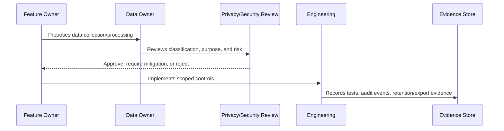

# Part 04 Summary

> *"Summarizes Data Protection and Privacy Governance and prepares for Book VI Part 05."*

---

# Purpose

Summarizes Data Protection and Privacy Governance and prepares for Book VI Part 05.

---

# Governance Problem

AI governance depends on data privacy governance because AI context and outputs are built from protected data.

---

# Governance Decision

## Decision

CLARA should proceed to AI Governance and Model Risk after data classification, inventory, PII handling, conversation privacy, AI privacy, retention, exports, attachments, privacy review, and evidence are defined.

## Status

Accepted.

---

# Data Governance Rule

Every important CLARA data category must be governed as:

```text
Data Category -> Classification -> Owner -> Purpose -> Access Scope -> Retention -> Evidence
```

No sensitive data flow should exist without:

```text
owner
classification
legal/business purpose
access boundary
retention rule
export rule
audit/evidence source
```

---

# Recommended Governance Flow



---

# Secure-by-Design Checklist

- [ ] Data category is identified.
- [ ] Classification is assigned.
- [ ] Owner is assigned.
- [ ] Processing purpose is documented.
- [ ] Organization/workspace scope is defined.
- [ ] Access controls are defined.
- [ ] Retention/deletion behavior is defined.
- [ ] Export behavior is defined.
- [ ] AI/integration usage is reviewed if relevant.
- [ ] Evidence source is defined.
- [ ] Privacy risk is documented.

---

# Acceptance Criteria

- [ ] Governance process is clear.
- [ ] Data owner is clear.
- [ ] Data classification is clear.
- [ ] Access and retention expectations are clear.
- [ ] Export and AI usage expectations are clear where relevant.
- [ ] Evidence requirements are clear.
- [ ] AI coding assistants can follow this safely.

---

# Anti-patterns

Avoid:

- Collecting data without purpose.
- Keeping customer data forever by default.
- Using production customer data in development.
- Treating internal notes as normal customer-visible text.
- Sending full conversation history to AI by default.
- Exporting data without audit.
- Storing raw attachments without access control.
- Logging raw customer content unnecessarily.
- Leaving data ownership undefined.

---

# Related Documents

- ../PART-02-Security-Policies-and-Standards/15-Data-Protection-and-Privacy-Policy.md
- ../PART-03-Identity-and-Access-Governance/README.md
- ../../BOOK-05-Engineering-Execution-Plan/PART-05-Database-and-Migration-Plan/README.md
- ../../BOOK-05-Engineering-Execution-Plan/PART-06-AI-Implementation-Plan/README.md
- ../../BOOK-05-Engineering-Execution-Plan/PART-08-Security-Implementation-Plan/README.md
- ../../BOOK-04-Product-Domain-Specification/BOOK-04-Master-Index/BOOK-04-AI-GOVERNANCE-MAP.md

---

# Navigation

**Previous:** `47-Data-Protection-Evidence-and-Monitoring.md`

**Next:** `../PART-05-AI-Governance-and-Model-Risk/README.md`

---

# Part 04 Completion

Part 04 establishes:

- Data protection and privacy governance overview.
- Data classification model.
- Data inventory and ownership.
- PII/customer data handling.
- Conversation and internal note privacy.
- AI data privacy and context governance.
- Data retention and deletion governance.
- Data export and portability governance.
- Attachment and media governance.
- Privacy review and DPIA-lite process.
- Data protection evidence and monitoring.

---

# Ready for Part 05

The next part should be:

```text
BOOK VI — PART 05: AI Governance and Model Risk
```

It should define:

- AI governance model.
- AI feature risk classification.
- Prompt governance.
- AI context governance.
- RAG/knowledge governance.
- Human review governance.
- AI output safety governance.
- AI evaluation governance.
- AI provider risk.
- AI audit/evidence.
- AI incident handling.
