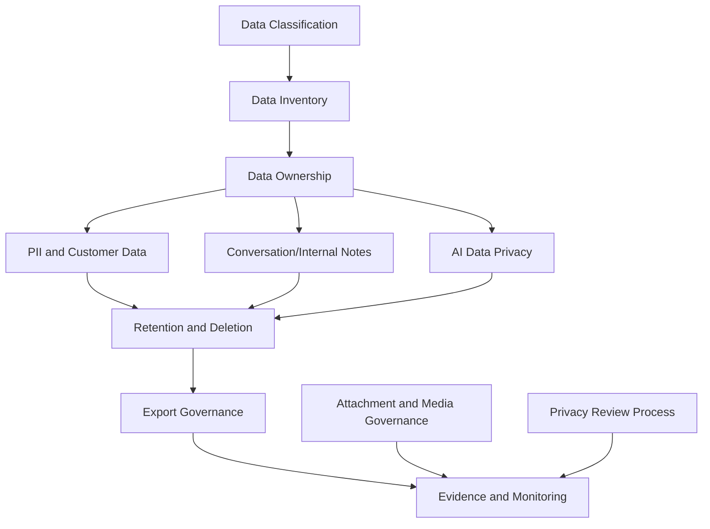

# PART-04 — Data Protection and Privacy Governance

> *"Data protection is not only encryption. It is knowing what data exists, why it exists, who can use it, how long it lives, and how it can safely leave."*

---

# Purpose

Part 04 defines CLARA's governance model for data protection and privacy.

It covers:

- Data Protection and Privacy Governance overview.
- Data Classification Model.
- Data Inventory and Ownership.
- PII and Customer Data Handling.
- Conversation and Internal Note Privacy.
- AI Data Privacy and Context Governance.
- Data Retention and Deletion Governance.
- Data Export and Portability Governance.
- Attachment and Media Data Governance.
- Privacy Review and DPIA Lite Process.
- Data Protection Evidence and Monitoring.

---

# Chapter Map

| Chapter | Title |
|---:|---|
| 37 | Data Protection and Privacy Governance Overview |
| 38 | Data Classification Model |
| 39 | Data Inventory and Ownership |
| 40 | PII and Customer Data Handling |
| 41 | Conversation and Internal Note Privacy |
| 42 | AI Data Privacy and Context Governance |
| 43 | Data Retention and Deletion Governance |
| 44 | Data Export and Portability Governance |
| 45 | Attachment and Media Data Governance |
| 46 | Privacy Review and DPIA Lite Process |
| 47 | Data Protection Evidence and Monitoring |
| 48 | Part 04 Summary |

---

# Data Protection Governance Map



---

# Governance Non-Negotiables

CLARA data protection governance must enforce:

```text
data classification
data ownership
tenant/workspace scope
least privilege data access
data minimization
privacy-aware AI context
internal note separation
export approval and audit
retention/deletion rules
attachment access control
no real customer data in development/test
privacy review for high-risk changes
evidence for sensitive data controls
```

---

# Relationship to Book V

Book V defines:

```text
database models
access controls
logging/audit
AI context implementation
integration security
testing and release gates
```

Book VI Part 04 defines:

```text
data protection governance, privacy expectations, ownership, retention, exports, and evidence
```

---

# Navigation

**Previous:** `../PART-03-Identity-and-Access-Governance/36-Part-03-Summary.md`

**Next:** `37-Data-Protection-and-Privacy-Governance-Overview.md`
