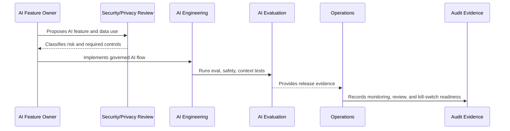

# AI Governance and Model Risk Overview

> *"Introduces CLARA's governance model for AI features, model risk, prompt governance, context safety, evaluation, auditability, incidents, and kill switches."*

---

# Purpose

Introduces CLARA's governance model for AI features, model risk, prompt governance, context safety, evaluation, auditability, incidents, and kill switches.

---

# Governance Problem

AI can create security, privacy, quality, compliance, and trust risk when treated as a normal feature instead of a governed capability.

---

# Governance Decision

## Decision

CLARA AI should be governed as a high-trust assistive system with explicit ownership, risk classification, context boundaries, review controls, monitoring, and evidence.

## Status

Accepted.

---

# AI Governance Rule

Every CLARA AI feature must be governed as:

```text
AI Feature -> Risk Classification -> Owner -> Data/Context Sources -> Review Control -> Evaluation -> Audit Evidence -> Kill Switch
```

No AI feature should ship without:

```text
purpose
owner
risk level
permission boundary
data handling rule
evaluation evidence
human review rule
fallback/disable path
audit metadata
```

---

# Recommended Governance Flow



---

# Secure-by-Design Checklist

- [ ] AI feature owner is assigned.
- [ ] AI risk level is assigned.
- [ ] Data/context sources are identified.
- [ ] Authorization boundary is enforced.
- [ ] Prompt template is versioned.
- [ ] RAG/knowledge eligibility is defined.
- [ ] Human review rule is defined.
- [ ] Output safety rules are defined.
- [ ] Provider risk is considered.
- [ ] Evaluation evidence exists.
- [ ] Audit metadata is defined.
- [ ] Kill switch/fallback exists.

---

# Acceptance Criteria

- [ ] Governance scope is clear.
- [ ] AI feature risk is clear.
- [ ] Context and data rules are clear.
- [ ] Human review expectations are clear.
- [ ] Evaluation and monitoring expectations are clear.
- [ ] Incident/disable path is clear.
- [ ] AI coding assistants can follow this safely.

---

# Anti-patterns

Avoid:

- Direct AI calls from UI.
- Sending full raw data by default.
- Using unauthorized context.
- Treating prompt text as unreviewed implementation detail.
- Auto-sending AI replies in MVP.
- No AI evaluation before release.
- No kill switch.
- No provider risk review.
- Logging full prompts/outputs without justification.
- Leaving AI behavior unexplained during incident investigation.

---

# Related Documents

- ../PART-04-Data-Protection-and-Privacy-Governance/42-AI-Data-Privacy-and-Context-Governance.md
- ../../BOOK-05-Engineering-Execution-Plan/PART-06-AI-Implementation-Plan/README.md
- ../../BOOK-05-Engineering-Execution-Plan/PART-08-Security-Implementation-Plan/140-AI-Security-Controls.md
- ../../BOOK-05-Engineering-Execution-Plan/PART-09-Testing-and-QA-Execution/154-AI-Evaluation-and-Testing.md
- ../../BOOK-04-Product-Domain-Specification/BOOK-04-Master-Index/BOOK-04-AI-GOVERNANCE-MAP.md

---

# Navigation

**Previous:** `../PART-04-Data-Protection-and-Privacy-Governance/48-Part-04-Summary.md`

**Next:** `50-AI-Feature-Risk-Classification.md`

---

# AI Governance Scope

CLARA AI governance covers:

```text
reply drafting
conversation summaries
customer summaries
ticket summaries
classification/extraction
knowledge retrieval/RAG
AI-assisted workflow suggestions
AI tool actions
AI analytics insights
AI feedback and evaluation
```

---

# Core AI Governance Questions

For every AI feature:

```text
What is the feature doing?
Who owns it?
What data does it use?
Who is allowed to trigger it?
Who sees the output?
Can it affect customers?
Can it mutate records?
How is quality measured?
How can it be disabled?
What evidence is retained?
```
