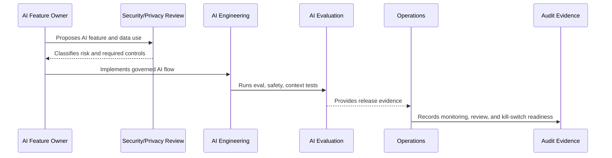

# AI Feature Risk Classification

> *"Defines how CLARA classifies AI features by risk level based on data sensitivity, autonomy, customer visibility, action capability, and business impact."*

---

# Purpose

Defines how CLARA classifies AI features by risk level based on data sensitivity, autonomy, customer visibility, action capability, and business impact.

---

# Governance Problem

Different AI features have different risk; a private summary is not the same risk as an auto-sent customer reply or automated workflow action.

---

# Governance Decision

## Decision

Every CLARA AI feature should be risk-classified before implementation and release.

## Status

Accepted.

---

# AI Governance Rule

Every CLARA AI feature must be governed as:

```text
AI Feature -> Risk Classification -> Owner -> Data/Context Sources -> Review Control -> Evaluation -> Audit Evidence -> Kill Switch
```

No AI feature should ship without:

```text
purpose
owner
risk level
permission boundary
data handling rule
evaluation evidence
human review rule
fallback/disable path
audit metadata
```

---

# Recommended Governance Flow



---

# Secure-by-Design Checklist

- [ ] AI feature owner is assigned.
- [ ] AI risk level is assigned.
- [ ] Data/context sources are identified.
- [ ] Authorization boundary is enforced.
- [ ] Prompt template is versioned.
- [ ] RAG/knowledge eligibility is defined.
- [ ] Human review rule is defined.
- [ ] Output safety rules are defined.
- [ ] Provider risk is considered.
- [ ] Evaluation evidence exists.
- [ ] Audit metadata is defined.
- [ ] Kill switch/fallback exists.

---

# Acceptance Criteria

- [ ] Governance scope is clear.
- [ ] AI feature risk is clear.
- [ ] Context and data rules are clear.
- [ ] Human review expectations are clear.
- [ ] Evaluation and monitoring expectations are clear.
- [ ] Incident/disable path is clear.
- [ ] AI coding assistants can follow this safely.

---

# Anti-patterns

Avoid:

- Direct AI calls from UI.
- Sending full raw data by default.
- Using unauthorized context.
- Treating prompt text as unreviewed implementation detail.
- Auto-sending AI replies in MVP.
- No AI evaluation before release.
- No kill switch.
- No provider risk review.
- Logging full prompts/outputs without justification.
- Leaving AI behavior unexplained during incident investigation.

---

# Related Documents

- ../PART-04-Data-Protection-and-Privacy-Governance/42-AI-Data-Privacy-and-Context-Governance.md
- ../../BOOK-05-Engineering-Execution-Plan/PART-06-AI-Implementation-Plan/README.md
- ../../BOOK-05-Engineering-Execution-Plan/PART-08-Security-Implementation-Plan/140-AI-Security-Controls.md
- ../../BOOK-05-Engineering-Execution-Plan/PART-09-Testing-and-QA-Execution/154-AI-Evaluation-and-Testing.md
- ../../BOOK-04-Product-Domain-Specification/BOOK-04-Master-Index/BOOK-04-AI-GOVERNANCE-MAP.md

---

# Navigation

**Previous:** `49-AI-Governance-and-Model-Risk-Overview.md`

**Next:** `51-AI-System-Inventory-and-Ownership.md`

---

# AI Risk Levels

| Risk | Description | Examples |
|---|---|---|
| Low | Internal assistive output, no sensitive action | internal draft notes, low-risk summarization |
| Medium | Uses sensitive context but remains internal/reviewed | conversation summary, lead classification |
| High | Customer-visible or operationally influential | reply draft, ticket priority suggestion |
| Critical | Autonomous external action or sensitive mutation | auto-send reply, auto-update billing/security setting |

---

# Risk Factors

Increase risk when AI:

```text
uses sensitive customer data
uses internal notes
is customer-visible
can trigger workflow/action
can affect billing/security/admin state
uses third-party provider
uses unverified retrieved knowledge
has no human review
```

---

# MVP Rule

For MVP, CLARA AI should stay mostly:

```text
Medium to High risk, but human-reviewed
```

Avoid Critical autonomous AI actions until governance matures.
