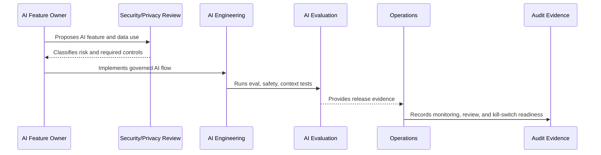

# AI Context and RAG Governance

> *"Defines governance for AI context assembly, retrieval-augmented generation, knowledge eligibility, permission boundaries, context minimization, and source attribution."*

---

# Purpose

Defines governance for AI context assembly, retrieval-augmented generation, knowledge eligibility, permission boundaries, context minimization, and source attribution.

---

# Governance Problem

AI context leakage can expose customer data, internal notes, private knowledge, or cross-workspace information.

---

# Governance Decision

## Decision

CLARA AI context should be built only from authorized, relevant, minimized, and eligible sources.

## Status

Accepted.

---

# AI Governance Rule

Every CLARA AI feature must be governed as:

```text
AI Feature -> Risk Classification -> Owner -> Data/Context Sources -> Review Control -> Evaluation -> Audit Evidence -> Kill Switch
```

No AI feature should ship without:

```text
purpose
owner
risk level
permission boundary
data handling rule
evaluation evidence
human review rule
fallback/disable path
audit metadata
```

---

# Recommended Governance Flow



---

# Secure-by-Design Checklist

- [ ] AI feature owner is assigned.
- [ ] AI risk level is assigned.
- [ ] Data/context sources are identified.
- [ ] Authorization boundary is enforced.
- [ ] Prompt template is versioned.
- [ ] RAG/knowledge eligibility is defined.
- [ ] Human review rule is defined.
- [ ] Output safety rules are defined.
- [ ] Provider risk is considered.
- [ ] Evaluation evidence exists.
- [ ] Audit metadata is defined.
- [ ] Kill switch/fallback exists.

---

# Acceptance Criteria

- [ ] Governance scope is clear.
- [ ] AI feature risk is clear.
- [ ] Context and data rules are clear.
- [ ] Human review expectations are clear.
- [ ] Evaluation and monitoring expectations are clear.
- [ ] Incident/disable path is clear.
- [ ] AI coding assistants can follow this safely.

---

# Anti-patterns

Avoid:

- Direct AI calls from UI.
- Sending full raw data by default.
- Using unauthorized context.
- Treating prompt text as unreviewed implementation detail.
- Auto-sending AI replies in MVP.
- No AI evaluation before release.
- No kill switch.
- No provider risk review.
- Logging full prompts/outputs without justification.
- Leaving AI behavior unexplained during incident investigation.

---

# Related Documents

- ../PART-04-Data-Protection-and-Privacy-Governance/42-AI-Data-Privacy-and-Context-Governance.md
- ../../BOOK-05-Engineering-Execution-Plan/PART-06-AI-Implementation-Plan/README.md
- ../../BOOK-05-Engineering-Execution-Plan/PART-08-Security-Implementation-Plan/140-AI-Security-Controls.md
- ../../BOOK-05-Engineering-Execution-Plan/PART-09-Testing-and-QA-Execution/154-AI-Evaluation-and-Testing.md
- ../../BOOK-04-Product-Domain-Specification/BOOK-04-Master-Index/BOOK-04-AI-GOVERNANCE-MAP.md

---

# Navigation

**Previous:** `52-Prompt-Governance.md`

**Next:** `54-Human-Review-and-Approval-Governance.md`

---

# AI Context Rules

Context must be:

```text
authorized
workspace-scoped
purpose-limited
minimized
relevant
source-attributed where practical
```

---

# RAG Governance Rules

RAG should use:

```text
published or explicitly eligible knowledge
workspace-scoped retrieval
visibility-aware filters
freshness metadata where useful
source references
quality feedback
```

---

# Forbidden Context by Default

Do not include by default:

```text
secrets
private/draft knowledge
unrelated customers
cross-workspace records
raw internal notes
full conversation history when summary is enough
```
