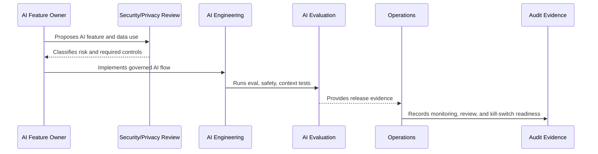

# Model Provider and Third Party AI Risk

> *"Defines governance for AI model providers, data sharing, provider configuration, retention settings, contractual/security review, fallback, and provider incidents."*

---

# Purpose

Defines governance for AI model providers, data sharing, provider configuration, retention settings, contractual/security review, fallback, and provider incidents.

---

# Governance Problem

AI providers process sensitive context and can affect privacy, availability, cost, and output quality.

---

# Governance Decision

## Decision

CLARA should assess AI providers as third-party risk sources and configure provider usage according to data sensitivity and business impact.

## Status

Accepted.

---

# AI Governance Rule

Every CLARA AI feature must be governed as:

```text
AI Feature -> Risk Classification -> Owner -> Data/Context Sources -> Review Control -> Evaluation -> Audit Evidence -> Kill Switch
```

No AI feature should ship without:

```text
purpose
owner
risk level
permission boundary
data handling rule
evaluation evidence
human review rule
fallback/disable path
audit metadata
```

---

# Recommended Governance Flow



---

# Secure-by-Design Checklist

- [ ] AI feature owner is assigned.
- [ ] AI risk level is assigned.
- [ ] Data/context sources are identified.
- [ ] Authorization boundary is enforced.
- [ ] Prompt template is versioned.
- [ ] RAG/knowledge eligibility is defined.
- [ ] Human review rule is defined.
- [ ] Output safety rules are defined.
- [ ] Provider risk is considered.
- [ ] Evaluation evidence exists.
- [ ] Audit metadata is defined.
- [ ] Kill switch/fallback exists.

---

# Acceptance Criteria

- [ ] Governance scope is clear.
- [ ] AI feature risk is clear.
- [ ] Context and data rules are clear.
- [ ] Human review expectations are clear.
- [ ] Evaluation and monitoring expectations are clear.
- [ ] Incident/disable path is clear.
- [ ] AI coding assistants can follow this safely.

---

# Anti-patterns

Avoid:

- Direct AI calls from UI.
- Sending full raw data by default.
- Using unauthorized context.
- Treating prompt text as unreviewed implementation detail.
- Auto-sending AI replies in MVP.
- No AI evaluation before release.
- No kill switch.
- No provider risk review.
- Logging full prompts/outputs without justification.
- Leaving AI behavior unexplained during incident investigation.

---

# Related Documents

- ../PART-04-Data-Protection-and-Privacy-Governance/42-AI-Data-Privacy-and-Context-Governance.md
- ../../BOOK-05-Engineering-Execution-Plan/PART-06-AI-Implementation-Plan/README.md
- ../../BOOK-05-Engineering-Execution-Plan/PART-08-Security-Implementation-Plan/140-AI-Security-Controls.md
- ../../BOOK-05-Engineering-Execution-Plan/PART-09-Testing-and-QA-Execution/154-AI-Evaluation-and-Testing.md
- ../../BOOK-04-Product-Domain-Specification/BOOK-04-Master-Index/BOOK-04-AI-GOVERNANCE-MAP.md

---

# Navigation

**Previous:** `55-AI-Output-Safety-and-Customer-Communication.md`

**Next:** `57-AI-Evaluation-Monitoring-and-Drift-Governance.md`

---

# Provider Risk Review

Assess:

```text
data sent to provider
provider retention/training settings
region/data residency expectations
availability/reliability
cost exposure
rate limits
security posture
terms/policies
fallback options
```

---

# Provider Configuration Rules

- Use server-side provider calls only.
- Keep provider keys secret.
- Disable training/retention where provider supports and policy requires.
- Minimize payload.
- Track provider errors/latency/cost.
- Define fallback/manual mode.

---

# Provider Incident Examples

```text
provider outage
provider latency spike
unexpected output quality drop
data retention setting misconfiguration
provider key leak
cost spike
```
