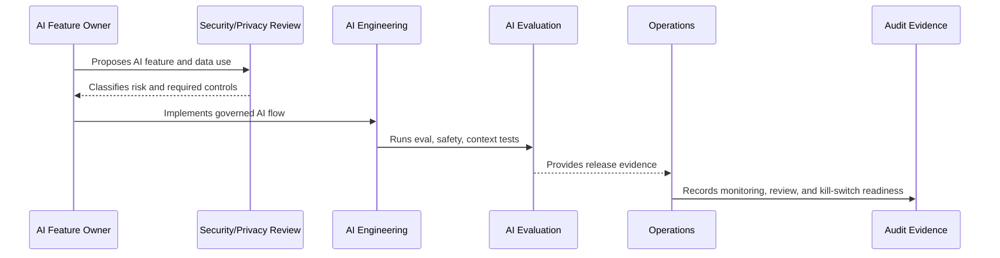

# AI Incident Handling and Kill Switch Governance

> *"Defines governance for AI incidents, safety blocks, provider outages, quality regressions, prompt injection events, context leaks, and kill switches."*

---

# Purpose

Defines governance for AI incidents, safety blocks, provider outages, quality regressions, prompt injection events, context leaks, and kill switches.

---

# Governance Problem

When AI fails, the product needs fast containment, not only post-release debugging.

---

# Governance Decision

## Decision

CLARA AI features should have clear incident paths and kill switches so risky behavior can be contained quickly.

## Status

Accepted.

---

# AI Governance Rule

Every CLARA AI feature must be governed as:

```text
AI Feature -> Risk Classification -> Owner -> Data/Context Sources -> Review Control -> Evaluation -> Audit Evidence -> Kill Switch
```

No AI feature should ship without:

```text
purpose
owner
risk level
permission boundary
data handling rule
evaluation evidence
human review rule
fallback/disable path
audit metadata
```

---

# Recommended Governance Flow



---

# Secure-by-Design Checklist

- [ ] AI feature owner is assigned.
- [ ] AI risk level is assigned.
- [ ] Data/context sources are identified.
- [ ] Authorization boundary is enforced.
- [ ] Prompt template is versioned.
- [ ] RAG/knowledge eligibility is defined.
- [ ] Human review rule is defined.
- [ ] Output safety rules are defined.
- [ ] Provider risk is considered.
- [ ] Evaluation evidence exists.
- [ ] Audit metadata is defined.
- [ ] Kill switch/fallback exists.

---

# Acceptance Criteria

- [ ] Governance scope is clear.
- [ ] AI feature risk is clear.
- [ ] Context and data rules are clear.
- [ ] Human review expectations are clear.
- [ ] Evaluation and monitoring expectations are clear.
- [ ] Incident/disable path is clear.
- [ ] AI coding assistants can follow this safely.

---

# Anti-patterns

Avoid:

- Direct AI calls from UI.
- Sending full raw data by default.
- Using unauthorized context.
- Treating prompt text as unreviewed implementation detail.
- Auto-sending AI replies in MVP.
- No AI evaluation before release.
- No kill switch.
- No provider risk review.
- Logging full prompts/outputs without justification.
- Leaving AI behavior unexplained during incident investigation.

---

# Related Documents

- ../PART-04-Data-Protection-and-Privacy-Governance/42-AI-Data-Privacy-and-Context-Governance.md
- ../../BOOK-05-Engineering-Execution-Plan/PART-06-AI-Implementation-Plan/README.md
- ../../BOOK-05-Engineering-Execution-Plan/PART-08-Security-Implementation-Plan/140-AI-Security-Controls.md
- ../../BOOK-05-Engineering-Execution-Plan/PART-09-Testing-and-QA-Execution/154-AI-Evaluation-and-Testing.md
- ../../BOOK-04-Product-Domain-Specification/BOOK-04-Master-Index/BOOK-04-AI-GOVERNANCE-MAP.md

---

# Navigation

**Previous:** `58-AI-Audit-Evidence-and-Traceability.md`

**Next:** `60-Part-05-Summary.md`

---

# AI Incident Types

Examples:

```text
AI leaks internal note
AI uses unauthorized context
AI drafts harmful or misleading reply
prompt injection succeeds
provider key leaks
provider outage impacts workflow
AI cost spikes
model quality regresses
RAG retrieves wrong/private source
```

---

# Kill Switch Requirements

AI features should support:

```text
disable feature globally
disable feature per workspace/org
disable provider
disable specific prompt version
disable RAG source
fallback to manual workflow
```

---

# Incident Response Steps

```text
detect
disable/contain
preserve evidence
assess affected users/data
communicate internally
remediate
run evaluation/regression
postmortem
update controls
```
