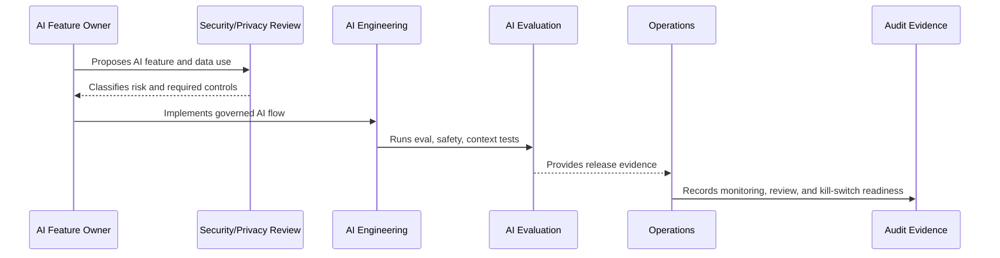

# Part 05 Summary

> *"Summarizes AI Governance and Model Risk and prepares for Book VI Part 06."*

---

# Purpose

Summarizes AI Governance and Model Risk and prepares for Book VI Part 06.

---

# Governance Problem

Integration governance comes next because external systems and AI both expand CLARA's trust boundary.

---

# Governance Decision

## Decision

CLARA should proceed to Integration and Third Party Governance after AI risk, inventory, prompts, context/RAG, review, output safety, provider risk, evaluation, audit, and incident controls are defined.

## Status

Accepted.

---

# AI Governance Rule

Every CLARA AI feature must be governed as:

```text
AI Feature -> Risk Classification -> Owner -> Data/Context Sources -> Review Control -> Evaluation -> Audit Evidence -> Kill Switch
```

No AI feature should ship without:

```text
purpose
owner
risk level
permission boundary
data handling rule
evaluation evidence
human review rule
fallback/disable path
audit metadata
```

---

# Recommended Governance Flow



---

# Secure-by-Design Checklist

- [ ] AI feature owner is assigned.
- [ ] AI risk level is assigned.
- [ ] Data/context sources are identified.
- [ ] Authorization boundary is enforced.
- [ ] Prompt template is versioned.
- [ ] RAG/knowledge eligibility is defined.
- [ ] Human review rule is defined.
- [ ] Output safety rules are defined.
- [ ] Provider risk is considered.
- [ ] Evaluation evidence exists.
- [ ] Audit metadata is defined.
- [ ] Kill switch/fallback exists.

---

# Acceptance Criteria

- [ ] Governance scope is clear.
- [ ] AI feature risk is clear.
- [ ] Context and data rules are clear.
- [ ] Human review expectations are clear.
- [ ] Evaluation and monitoring expectations are clear.
- [ ] Incident/disable path is clear.
- [ ] AI coding assistants can follow this safely.

---

# Anti-patterns

Avoid:

- Direct AI calls from UI.
- Sending full raw data by default.
- Using unauthorized context.
- Treating prompt text as unreviewed implementation detail.
- Auto-sending AI replies in MVP.
- No AI evaluation before release.
- No kill switch.
- No provider risk review.
- Logging full prompts/outputs without justification.
- Leaving AI behavior unexplained during incident investigation.

---

# Related Documents

- ../PART-04-Data-Protection-and-Privacy-Governance/42-AI-Data-Privacy-and-Context-Governance.md
- ../../BOOK-05-Engineering-Execution-Plan/PART-06-AI-Implementation-Plan/README.md
- ../../BOOK-05-Engineering-Execution-Plan/PART-08-Security-Implementation-Plan/140-AI-Security-Controls.md
- ../../BOOK-05-Engineering-Execution-Plan/PART-09-Testing-and-QA-Execution/154-AI-Evaluation-and-Testing.md
- ../../BOOK-04-Product-Domain-Specification/BOOK-04-Master-Index/BOOK-04-AI-GOVERNANCE-MAP.md

---

# Navigation

**Previous:** `59-AI-Incident-Handling-and-Kill-Switch-Governance.md`

**Next:** `../PART-06-Integration-and-Third-Party-Governance/README.md`

---

# Part 05 Completion

Part 05 establishes:

- AI governance and model risk overview.
- AI feature risk classification.
- AI system inventory and ownership.
- Prompt governance.
- AI context and RAG governance.
- Human review and approval governance.
- AI output safety and customer communication governance.
- Model provider and third-party AI risk governance.
- AI evaluation, monitoring, and drift governance.
- AI audit evidence and traceability.
- AI incident handling and kill switch governance.

---

# Ready for Part 06

The next part should be:

```text
BOOK VI — PART 06: Integration and Third-Party Governance
```

It should define:

- Third-party inventory.
- Integration risk classification.
- Provider onboarding review.
- Credential governance.
- Webhook/API governance.
- Data sharing governance.
- Vendor incident governance.
- Integration monitoring and evidence.
- Connector lifecycle governance.
- Third-party risk acceptance.
