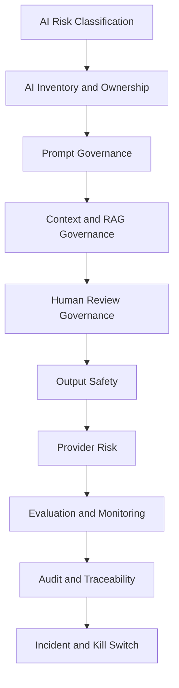

# PART-05 — AI Governance and Model Risk

> *"AI is powerful because it can reason over context. AI is risky for the same reason."*

---

# Purpose

Part 05 defines CLARA's governance model for AI features and model risk.

It covers:

- AI Governance and Model Risk overview.
- AI Feature Risk Classification.
- AI System Inventory and Ownership.
- Prompt Governance.
- AI Context and RAG Governance.
- Human Review and Approval Governance.
- AI Output Safety and Customer Communication.
- Model Provider and Third Party AI Risk.
- AI Evaluation, Monitoring, and Drift Governance.
- AI Audit Evidence and Traceability.
- AI Incident Handling and Kill Switch Governance.

---

# Chapter Map

| Chapter | Title |
|---:|---|
| 49 | AI Governance and Model Risk Overview |
| 50 | AI Feature Risk Classification |
| 51 | AI System Inventory and Ownership |
| 52 | Prompt Governance |
| 53 | AI Context and RAG Governance |
| 54 | Human Review and Approval Governance |
| 55 | AI Output Safety and Customer Communication |
| 56 | Model Provider and Third Party AI Risk |
| 57 | AI Evaluation Monitoring and Drift Governance |
| 58 | AI Audit Evidence and Traceability |
| 59 | AI Incident Handling and Kill Switch Governance |
| 60 | Part 05 Summary |

---

# AI Governance Map



---

# Governance Non-Negotiables

CLARA AI governance must enforce:

```text
AI Gateway only
no frontend direct model calls
AI feature risk classification
AI system inventory
prompt versioning
context minimization
permission-scoped context
eligible knowledge only by default
human review before customer-visible output in MVP
AI output traceability
AI evaluation before release
provider risk awareness
kill switch for risky AI behavior
```

---

# Relationship to Book V

Book V defines:

```text
AI Gateway
provider abstraction
prompt templates
context builder
RAG
reply drafting
human review
AI audit
AI testing
AI monitoring
```

Book VI Part 05 defines:

```text
how AI capability is governed, risk-classified, reviewed, monitored, and controlled
```

---

# Navigation

**Previous:** `../PART-04-Data-Protection-and-Privacy-Governance/48-Part-04-Summary.md`

**Next:** `49-AI-Governance-and-Model-Risk-Overview.md`
