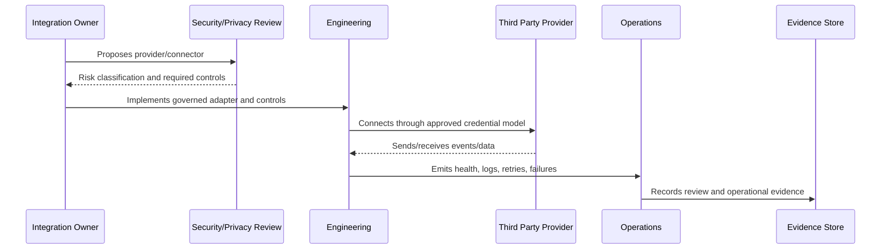

# Webhook and API Governance

> *"Defines governance for inbound webhooks, outbound webhooks, external APIs, validation, signatures, idempotency, retries, rate limits, and abuse protection."*

---

# Purpose

Defines governance for inbound webhooks, outbound webhooks, external APIs, validation, signatures, idempotency, retries, rate limits, and abuse protection.

---

# Governance Problem

Untrusted webhook/API traffic can cause forged events, duplicate processing, injection, SSRF, data poisoning, or operational overload.

---

# Governance Decision

## Decision

CLARA webhook and API integrations must validate payloads, authenticate sources, enforce idempotency, protect against abuse, and preserve evidence.

## Status

Accepted.

---

# Integration Governance Rule

Every CLARA integration or third-party dependency must be governed as:

```text
Provider -> Purpose -> Owner -> Risk Level -> Data Shared -> Credential Model -> Controls -> Monitoring -> Exit Plan
```

No integration should ship without:

```text
inventory record
owner
risk classification
authentication/credential model
data sharing review
validation/idempotency plan
monitoring and evidence
incident path
offboarding plan
```

---

# Recommended Governance Flow



---

# Secure-by-Design Checklist

- [ ] Third-party owner is assigned.
- [ ] Provider purpose is documented.
- [ ] Risk level is assigned.
- [ ] Data shared/received is documented.
- [ ] Credential model is secure.
- [ ] Webhook/API authentication exists where applicable.
- [ ] Payload validation exists.
- [ ] Idempotency is defined.
- [ ] Retry/failure handling is defined.
- [ ] Monitoring and health checks exist.
- [ ] Offboarding/revocation path exists.
- [ ] Risk acceptance is documented where needed.

---

# Acceptance Criteria

- [ ] Governance scope is clear.
- [ ] Third-party inventory fields are clear.
- [ ] Risk classification is clear.
- [ ] Credential and data sharing rules are clear.
- [ ] Monitoring and incident expectations are clear.
- [ ] Offboarding and exceptions are clear.
- [ ] AI coding assistants can follow this safely.

---

# Anti-patterns

Avoid:

- Adding provider integrations without owner.
- Storing raw provider secrets in normal database columns.
- Trusting webhook payloads without validation.
- Ignoring duplicate events.
- Logging full provider payloads by default.
- Sharing unnecessary customer data.
- No provider outage fallback.
- No connector removal process.
- No risk acceptance for weak provider controls.
- Direct product module calls to provider APIs outside Integration Gateway.

---

# Related Documents

- ../PART-02-Security-Policies-and-Standards/20-Integration-and-Third-Party-Security-Policy.md
- ../PART-04-Data-Protection-and-Privacy-Governance/67-Data-Sharing-and-Processing-Governance.md
- ../PART-05-AI-Governance-and-Model-Risk/56-Model-Provider-and-Third-Party-AI-Risk.md
- ../../BOOK-05-Engineering-Execution-Plan/PART-07-Integration-Implementation-Plan/README.md
- ../../BOOK-05-Engineering-Execution-Plan/PART-08-Security-Implementation-Plan/141-Integration-Security-Controls.md

---

# Navigation

**Previous:** `65-Credential-and-Secret-Governance-for-Integrations.md`

**Next:** `67-Data-Sharing-and-Processing-Governance.md`

---

# Webhook Governance Requirements

Inbound webhooks should enforce:

```text
source authentication
signature/API key validation where supported
timestamp/replay protection where supported
schema validation
idempotency
rate limiting
safe error responses
dead-letter/failure handling
audit/trace ID
```

---

# Outbound API/Webhook Requirements

Outbound integrations should enforce:

```text
destination validation
timeout limits
retry policy
idempotency key where supported
secret redaction
SSRF protection for configurable URLs
failure monitoring
```

---

# Webhook Evidence

Record:

```text
event id
provider
connector id
organization/workspace
signature validation result
idempotency result
processing status
failure reason
retry count
timestamp
```
