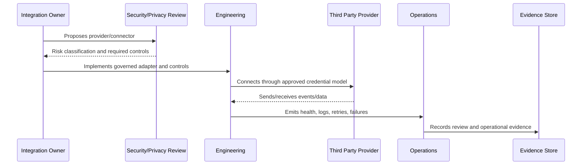

# Third Party Incident and Outage Governance

> *"Defines governance for provider outages, credential leaks, webhook abuse, API failures, data sharing incidents, vendor security events, and escalation."*

---

# Purpose

Defines governance for provider outages, credential leaks, webhook abuse, API failures, data sharing incidents, vendor security events, and escalation.

---

# Governance Problem

External incidents can still become CLARA incidents when they affect customer data, availability, or trust.

---

# Governance Decision

## Decision

CLARA should have incident paths for third-party failures and security events, including containment, fallback, provider communication, customer impact review, and postmortem.

## Status

Accepted.

---

# Integration Governance Rule

Every CLARA integration or third-party dependency must be governed as:

```text
Provider -> Purpose -> Owner -> Risk Level -> Data Shared -> Credential Model -> Controls -> Monitoring -> Exit Plan
```

No integration should ship without:

```text
inventory record
owner
risk classification
authentication/credential model
data sharing review
validation/idempotency plan
monitoring and evidence
incident path
offboarding plan
```

---

# Recommended Governance Flow



---

# Secure-by-Design Checklist

- [ ] Third-party owner is assigned.
- [ ] Provider purpose is documented.
- [ ] Risk level is assigned.
- [ ] Data shared/received is documented.
- [ ] Credential model is secure.
- [ ] Webhook/API authentication exists where applicable.
- [ ] Payload validation exists.
- [ ] Idempotency is defined.
- [ ] Retry/failure handling is defined.
- [ ] Monitoring and health checks exist.
- [ ] Offboarding/revocation path exists.
- [ ] Risk acceptance is documented where needed.

---

# Acceptance Criteria

- [ ] Governance scope is clear.
- [ ] Third-party inventory fields are clear.
- [ ] Risk classification is clear.
- [ ] Credential and data sharing rules are clear.
- [ ] Monitoring and incident expectations are clear.
- [ ] Offboarding and exceptions are clear.
- [ ] AI coding assistants can follow this safely.

---

# Anti-patterns

Avoid:

- Adding provider integrations without owner.
- Storing raw provider secrets in normal database columns.
- Trusting webhook payloads without validation.
- Ignoring duplicate events.
- Logging full provider payloads by default.
- Sharing unnecessary customer data.
- No provider outage fallback.
- No connector removal process.
- No risk acceptance for weak provider controls.
- Direct product module calls to provider APIs outside Integration Gateway.

---

# Related Documents

- ../PART-02-Security-Policies-and-Standards/20-Integration-and-Third-Party-Security-Policy.md
- ../PART-04-Data-Protection-and-Privacy-Governance/67-Data-Sharing-and-Processing-Governance.md
- ../PART-05-AI-Governance-and-Model-Risk/56-Model-Provider-and-Third-Party-AI-Risk.md
- ../../BOOK-05-Engineering-Execution-Plan/PART-07-Integration-Implementation-Plan/README.md
- ../../BOOK-05-Engineering-Execution-Plan/PART-08-Security-Implementation-Plan/141-Integration-Security-Controls.md

---

# Navigation

**Previous:** `68-Connector-Lifecycle-Governance.md`

**Next:** `70-Integration-Monitoring-Evidence-and-Health-Governance.md`

---

# Third-Party Incident Types

Examples:

```text
provider outage
provider credential leak
webhook abuse/spam
API schema breaking change
provider sends malformed data
duplicate event flood
provider security breach
provider data retention issue
rate limit exhaustion
```

---

# Incident Response Requirements

```text
detect and classify
contain or disable connector
preserve evidence
contact provider if needed
assess customer/data impact
activate fallback/manual workflow
communicate internally/customer-facing where needed
postmortem and control update
```

---

# Fallback Examples

```text
manual reply workflow
pause ingestion
queue for retry
disable outbound send
switch provider if supported
show degraded status to operators
```
