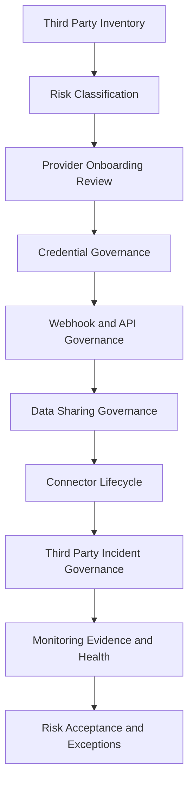

# PART-06 — Integration and Third Party Governance

> *"Every integration is a bridge across CLARA's trust boundary. Bridges need ownership, controls, monitoring, and an exit plan."*

---

# Purpose

Part 06 defines CLARA's governance model for integrations and third-party providers.

It covers:

- Integration and Third Party Governance overview.
- Third Party Inventory and Ownership.
- Integration Risk Classification.
- Provider Onboarding and Security Review.
- Credential and Secret Governance for Integrations.
- Webhook and API Governance.
- Data Sharing and Processing Governance.
- Connector Lifecycle Governance.
- Third Party Incident and Outage Governance.
- Integration Monitoring Evidence and Health Governance.
- Third Party Risk Acceptance and Exceptions.

---

# Chapter Map

| Chapter | Title |
|---:|---|
| 61 | Integration and Third Party Governance Overview |
| 62 | Third Party Inventory and Ownership |
| 63 | Integration Risk Classification |
| 64 | Provider Onboarding and Security Review |
| 65 | Credential and Secret Governance for Integrations |
| 66 | Webhook and API Governance |
| 67 | Data Sharing and Processing Governance |
| 68 | Connector Lifecycle Governance |
| 69 | Third Party Incident and Outage Governance |
| 70 | Integration Monitoring Evidence and Health Governance |
| 71 | Third Party Risk Acceptance and Exceptions |
| 72 | Part 06 Summary |

---

# Integration Governance Map



---

# Governance Non-Negotiables

CLARA integration governance must enforce:

```text
third-party inventory
named owner for every provider/connector
risk classification before production
credential secrecy and revocation
webhook/API authentication
payload validation
idempotency
data sharing minimization
health monitoring
retry/dead-letter evidence
audit logs for connector lifecycle
incident path for provider failures
documented risk acceptance
safe offboarding
```

---

# Relationship to Book V

Book V defines:

```text
Integration Gateway
provider adapter pattern
credential handling
webhook ingestion
outbound delivery
idempotency
integration observability
integration security testing
release rollout
```

Book VI Part 06 defines:

```text
how those integrations and third-party dependencies are governed, approved, reviewed, evidenced, and retired
```

---

# Navigation

**Previous:** `../PART-05-AI-Governance-and-Model-Risk/60-Part-05-Summary.md`

**Next:** `61-Integration-and-Third-Party-Governance-Overview.md`
