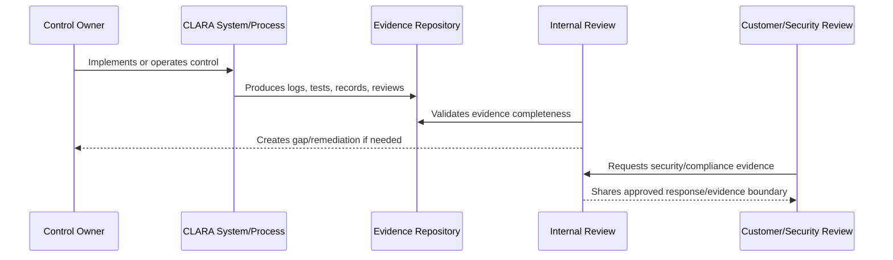

# Compliance Gap Tracking

> *"Defines how CLARA identifies, tracks, prioritizes, mitigates, accepts, and closes compliance/security gaps."*

---

# Purpose

Defines how CLARA identifies, tracks, prioritizes, mitigates, accepts, and closes compliance/security gaps.

---

# Governance Problem

Compliance gaps that are not tracked become recurring surprises during customer reviews, incidents, or go-live decisions.

---

# Governance Decision

## Decision

CLARA compliance gaps should be tracked like engineering work: owned, prioritized, time-bound, evidenced, and reviewed.

## Status

Accepted.

---

# Audit Readiness Rule

Every compliance-relevant control must be managed as:

```text
Control -> Owner -> Implementation -> Evidence -> Review Cadence -> Gap Status -> Customer/Compliance Use
```

No readiness claim should be made unless it can be backed by evidence.

---

# Recommended Evidence Flow



---

# Secure-by-Design Checklist

- [ ] Control owner is assigned.
- [ ] Evidence source is defined.
- [ ] Evidence is timestamped.
- [ ] Evidence is reviewable.
- [ ] Evidence access is controlled.
- [ ] Audit logs are privacy-aware.
- [ ] Gaps are tracked.
- [ ] Customer-facing claims are evidence-backed.
- [ ] Compliance scope is not overclaimed.
- [ ] Review cadence is defined.

---

# Acceptance Criteria

- [ ] Evidence model is clear.
- [ ] Control mapping is clear.
- [ ] Audit log expectations are clear.
- [ ] Gap tracking is clear.
- [ ] Customer review process is clear.
- [ ] Compliance roadmap is realistic.
- [ ] AI coding assistants can follow this safely.

---

# Anti-patterns

Avoid:

- Saying “we are compliant” without scope and evidence.
- Collecting screenshots as the only evidence.
- Evidence stored only in private chats.
- Audit logs with no actor/scope/timestamp.
- Audit logs leaking secrets or unnecessary content.
- Security questionnaire answers copied blindly.
- Customer-facing trust claims that engineering cannot prove.
- Gaps with no owner or due date.
- Controls that are implemented but never reviewed.

---

# Related Documents

- ../PART-01-Security-Governance-Foundation/10-Evidence-and-Auditability-Model.md
- ../PART-02-Security-Policies-and-Standards/18-Logging-Audit-and-Evidence-Policy.md
- ../PART-03-Identity-and-Access-Governance/35-Access-Audit-Evidence-and-Monitoring.md
- ../PART-04-Data-Protection-and-Privacy-Governance/47-Data-Protection-Evidence-and-Monitoring.md
- ../PART-05-AI-Governance-and-Model-Risk/58-AI-Audit-Evidence-and-Traceability.md
- ../PART-06-Integration-and-Third-Party-Governance/70-Integration-Monitoring-Evidence-and-Health-Governance.md

---

# Navigation

**Previous:** `77-Evidence-Repository-and-Retention.md`

**Next:** `79-Security-Questionnaire-Readiness.md`

---

# Compliance Gap Template

```markdown
# Compliance / Control Gap

## Gap ID
GAP-0001

## Control / Area
Which control area is affected.

## Description
What is missing or incomplete.

## Risk
What could happen.

## Severity
Critical / High / Medium / Low

## Owner
Who owns remediation.

## Target Date
Due date.

## Remediation Plan
Planned actions.

## Compensating Controls
Temporary mitigations.

## Status
Open / In Progress / Accepted / Closed

## Evidence
Links proving closure.
```

---

# Gap Closure Rule

A gap is not closed until evidence proves the remediation works.
