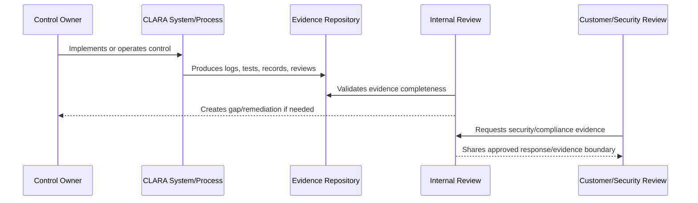

# Security Questionnaire Readiness

> *"Defines readiness model for answering customer/vendor security questionnaires, due diligence requests, and enterprise procurement reviews."*

---

# Purpose

Defines readiness model for answering customer/vendor security questionnaires, due diligence requests, and enterprise procurement reviews.

---

# Governance Problem

Security questionnaire answers become risky when they are improvised, unsupported by evidence, or overclaim maturity.

---

# Governance Decision

## Decision

CLARA should maintain reusable, evidence-backed answers for common security questionnaire topics.

## Status

Accepted.

---

# Audit Readiness Rule

Every compliance-relevant control must be managed as:

```text
Control -> Owner -> Implementation -> Evidence -> Review Cadence -> Gap Status -> Customer/Compliance Use
```

No readiness claim should be made unless it can be backed by evidence.

---

# Recommended Evidence Flow



---

# Secure-by-Design Checklist

- [ ] Control owner is assigned.
- [ ] Evidence source is defined.
- [ ] Evidence is timestamped.
- [ ] Evidence is reviewable.
- [ ] Evidence access is controlled.
- [ ] Audit logs are privacy-aware.
- [ ] Gaps are tracked.
- [ ] Customer-facing claims are evidence-backed.
- [ ] Compliance scope is not overclaimed.
- [ ] Review cadence is defined.

---

# Acceptance Criteria

- [ ] Evidence model is clear.
- [ ] Control mapping is clear.
- [ ] Audit log expectations are clear.
- [ ] Gap tracking is clear.
- [ ] Customer review process is clear.
- [ ] Compliance roadmap is realistic.
- [ ] AI coding assistants can follow this safely.

---

# Anti-patterns

Avoid:

- Saying “we are compliant” without scope and evidence.
- Collecting screenshots as the only evidence.
- Evidence stored only in private chats.
- Audit logs with no actor/scope/timestamp.
- Audit logs leaking secrets or unnecessary content.
- Security questionnaire answers copied blindly.
- Customer-facing trust claims that engineering cannot prove.
- Gaps with no owner or due date.
- Controls that are implemented but never reviewed.

---

# Related Documents

- ../PART-01-Security-Governance-Foundation/10-Evidence-and-Auditability-Model.md
- ../PART-02-Security-Policies-and-Standards/18-Logging-Audit-and-Evidence-Policy.md
- ../PART-03-Identity-and-Access-Governance/35-Access-Audit-Evidence-and-Monitoring.md
- ../PART-04-Data-Protection-and-Privacy-Governance/47-Data-Protection-Evidence-and-Monitoring.md
- ../PART-05-AI-Governance-and-Model-Risk/58-AI-Audit-Evidence-and-Traceability.md
- ../PART-06-Integration-and-Third-Party-Governance/70-Integration-Monitoring-Evidence-and-Health-Governance.md

---

# Navigation

**Previous:** `78-Compliance-Gap-Tracking.md`

**Next:** `80-Trust-Center-and-Customer-Evidence-Readiness.md`

---

# Common Security Questionnaire Topics

Prepare answers for:

```text
company/security overview
data hosting
authentication
authorization/RBAC
encryption
data retention/deletion
backup/restore
incident response
vulnerability management
secure development
AI governance
third-party providers
logging/audit
privacy practices
business continuity
```

---

# Questionnaire Response Rules

- Answer truthfully.
- Do not overclaim certifications.
- Link evidence internally.
- Share external evidence only through approved boundaries.
- Escalate unknown/high-risk questions.
- Keep canonical answers updated.

---

# Safe Answer Pattern

```text
Current state
Evidence or control summary
Limitations
Planned improvements where relevant
```
