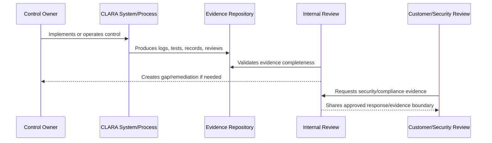

# Trust Center and Customer Evidence Readiness

> *"Defines governance for preparing external-facing trust evidence, customer-facing security summaries, status notes, and safe disclosure boundaries."*

---

# Purpose

Defines governance for preparing external-facing trust evidence, customer-facing security summaries, status notes, and safe disclosure boundaries.

---

# Governance Problem

Over-sharing security details can create attack surface, while under-sharing can block enterprise trust.

---

# Governance Decision

## Decision

CLARA should prepare customer-facing trust materials that are accurate, useful, and careful not to reveal sensitive implementation details.

## Status

Accepted.

---

# Audit Readiness Rule

Every compliance-relevant control must be managed as:

```text
Control -> Owner -> Implementation -> Evidence -> Review Cadence -> Gap Status -> Customer/Compliance Use
```

No readiness claim should be made unless it can be backed by evidence.

---

# Recommended Evidence Flow



---

# Secure-by-Design Checklist

- [ ] Control owner is assigned.
- [ ] Evidence source is defined.
- [ ] Evidence is timestamped.
- [ ] Evidence is reviewable.
- [ ] Evidence access is controlled.
- [ ] Audit logs are privacy-aware.
- [ ] Gaps are tracked.
- [ ] Customer-facing claims are evidence-backed.
- [ ] Compliance scope is not overclaimed.
- [ ] Review cadence is defined.

---

# Acceptance Criteria

- [ ] Evidence model is clear.
- [ ] Control mapping is clear.
- [ ] Audit log expectations are clear.
- [ ] Gap tracking is clear.
- [ ] Customer review process is clear.
- [ ] Compliance roadmap is realistic.
- [ ] AI coding assistants can follow this safely.

---

# Anti-patterns

Avoid:

- Saying “we are compliant” without scope and evidence.
- Collecting screenshots as the only evidence.
- Evidence stored only in private chats.
- Audit logs with no actor/scope/timestamp.
- Audit logs leaking secrets or unnecessary content.
- Security questionnaire answers copied blindly.
- Customer-facing trust claims that engineering cannot prove.
- Gaps with no owner or due date.
- Controls that are implemented but never reviewed.

---

# Related Documents

- ../PART-01-Security-Governance-Foundation/10-Evidence-and-Auditability-Model.md
- ../PART-02-Security-Policies-and-Standards/18-Logging-Audit-and-Evidence-Policy.md
- ../PART-03-Identity-and-Access-Governance/35-Access-Audit-Evidence-and-Monitoring.md
- ../PART-04-Data-Protection-and-Privacy-Governance/47-Data-Protection-Evidence-and-Monitoring.md
- ../PART-05-AI-Governance-and-Model-Risk/58-AI-Audit-Evidence-and-Traceability.md
- ../PART-06-Integration-and-Third-Party-Governance/70-Integration-Monitoring-Evidence-and-Health-Governance.md

---

# Navigation

**Previous:** `79-Security-Questionnaire-Readiness.md`

**Next:** `81-Internal-Compliance-Review-Cadence.md`

---

# Trust Material Categories

CLARA may prepare:

```text
security overview
data protection overview
AI governance summary
integration security summary
incident response summary
subprocessor/provider list
uptime/status summary
security contact process
responsible disclosure notes
```

---

# External Disclosure Boundary

Do not publicly expose:

```text
secret storage details
exact internal system architecture if sensitive
detection rules
private incident details
vulnerability details before remediation
customer-specific evidence
internal admin URLs
```

---

# Trust Rule

Customer-facing trust content must be accurate, evidence-backed, and reviewed before publication.
