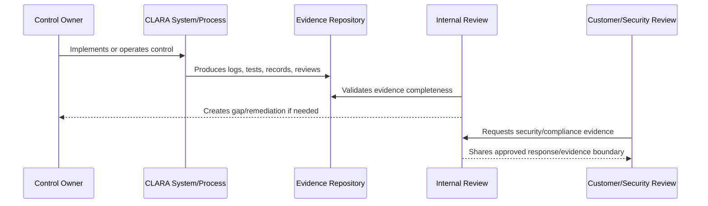

# Customer Security Review Response Process

> *"Defines how CLARA handles customer security reviews, evidence requests, NDA-bound materials, questionnaire workflows, and escalation."*

---

# Purpose

Defines how CLARA handles customer security reviews, evidence requests, NDA-bound materials, questionnaire workflows, and escalation.

---

# Governance Problem

Customer security requests can accidentally cause inconsistent promises or unsafe disclosure if handled informally.

---

# Governance Decision

## Decision

CLARA should handle customer security reviews through a controlled response process with approved answers, evidence boundaries, owner review, and risk escalation.

## Status

Accepted.

---

# Audit Readiness Rule

Every compliance-relevant control must be managed as:

```text
Control -> Owner -> Implementation -> Evidence -> Review Cadence -> Gap Status -> Customer/Compliance Use
```

No readiness claim should be made unless it can be backed by evidence.

---

# Recommended Evidence Flow



---

# Secure-by-Design Checklist

- [ ] Control owner is assigned.
- [ ] Evidence source is defined.
- [ ] Evidence is timestamped.
- [ ] Evidence is reviewable.
- [ ] Evidence access is controlled.
- [ ] Audit logs are privacy-aware.
- [ ] Gaps are tracked.
- [ ] Customer-facing claims are evidence-backed.
- [ ] Compliance scope is not overclaimed.
- [ ] Review cadence is defined.

---

# Acceptance Criteria

- [ ] Evidence model is clear.
- [ ] Control mapping is clear.
- [ ] Audit log expectations are clear.
- [ ] Gap tracking is clear.
- [ ] Customer review process is clear.
- [ ] Compliance roadmap is realistic.
- [ ] AI coding assistants can follow this safely.

---

# Anti-patterns

Avoid:

- Saying “we are compliant” without scope and evidence.
- Collecting screenshots as the only evidence.
- Evidence stored only in private chats.
- Audit logs with no actor/scope/timestamp.
- Audit logs leaking secrets or unnecessary content.
- Security questionnaire answers copied blindly.
- Customer-facing trust claims that engineering cannot prove.
- Gaps with no owner or due date.
- Controls that are implemented but never reviewed.

---

# Related Documents

- ../PART-01-Security-Governance-Foundation/10-Evidence-and-Auditability-Model.md
- ../PART-02-Security-Policies-and-Standards/18-Logging-Audit-and-Evidence-Policy.md
- ../PART-03-Identity-and-Access-Governance/35-Access-Audit-Evidence-and-Monitoring.md
- ../PART-04-Data-Protection-and-Privacy-Governance/47-Data-Protection-Evidence-and-Monitoring.md
- ../PART-05-AI-Governance-and-Model-Risk/58-AI-Audit-Evidence-and-Traceability.md
- ../PART-06-Integration-and-Third-Party-Governance/70-Integration-Monitoring-Evidence-and-Health-Governance.md

---

# Navigation

**Previous:** `81-Internal-Compliance-Review-Cadence.md`

**Next:** `83-Compliance-Roadmap-and-Framework-Alignment.md`

---

# Customer Security Review Workflow

```text
1. Receive request
2. Classify request sensitivity
3. Identify required answers/evidence
4. Use approved canonical answers
5. Escalate unknown/high-risk claims
6. Share evidence through approved channel
7. Record what was shared
8. Track follow-up commitments
```

---

# Customer Evidence Levels

| Level | Example |
|---|---|
| Public | Security overview |
| NDA-bound | Detailed security questionnaire |
| Restricted | Architecture/security diagrams |
| Internal only | Raw logs, incident details, secrets, sensitive configs |

---

# Response Rule

Never promise a control exists unless engineering/security can prove it.
