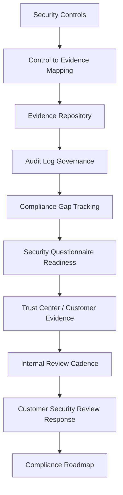

# PART-07 — Audit Evidence and Compliance Readiness

> *"Compliance readiness is not a certificate. It is the ability to prove that CLARA is controlled, reviewed, and improving."*

---

# Purpose

Part 07 defines CLARA's audit evidence and compliance readiness model.

It covers:

- Audit Evidence and Compliance Readiness overview.
- Audit Evidence Model.
- Control to Evidence Mapping.
- Audit Log Governance.
- Evidence Repository and Retention.
- Compliance Gap Tracking.
- Security Questionnaire Readiness.
- Trust Center and Customer Evidence Readiness.
- Internal Compliance Review Cadence.
- Customer Security Review Response Process.
- Compliance Roadmap and Framework Alignment.

---

# Chapter Map

| Chapter | Title |
|---:|---|
| 73 | Audit Evidence and Compliance Readiness Overview |
| 74 | Audit Evidence Model |
| 75 | Control to Evidence Mapping |
| 76 | Audit Log Governance |
| 77 | Evidence Repository and Retention |
| 78 | Compliance Gap Tracking |
| 79 | Security Questionnaire Readiness |
| 80 | Trust Center and Customer Evidence Readiness |
| 81 | Internal Compliance Review Cadence |
| 82 | Customer Security Review Response Process |
| 83 | Compliance Roadmap and Framework Alignment |
| 84 | Part 07 Summary |

---

# Audit Readiness Map



---

# Governance Non-Negotiables

CLARA audit and compliance readiness must enforce:

```text
evidence for security controls
evidence ownership
audit log taxonomy
audit log access control
evidence retention
compliance gap tracking
accurate customer-facing answers
no overclaiming certification
internal review cadence
customer security review workflow
framework alignment roadmap
```

---

# Compliance Readiness Disclaimer

This book establishes readiness and governance foundations.

It does not claim CLARA is certified against any external framework until a formal audit/certification process is completed.

---

# Relationship to Previous Parts

| Part | Contribution to Audit Readiness |
|---|---|
| Part 01 | Governance owners, risk, RACI |
| Part 02 | Policies and standards |
| Part 03 | Identity/access evidence |
| Part 04 | Data/privacy evidence |
| Part 05 | AI governance evidence |
| Part 06 | Third-party/integration evidence |
| Part 07 | Evidence model, audit readiness, compliance map |

---

# Navigation

**Previous:** `../PART-06-Integration-and-Third-Party-Governance/72-Part-06-Summary.md`

**Next:** `73-Audit-Evidence-and-Compliance-Readiness-Overview.md`
